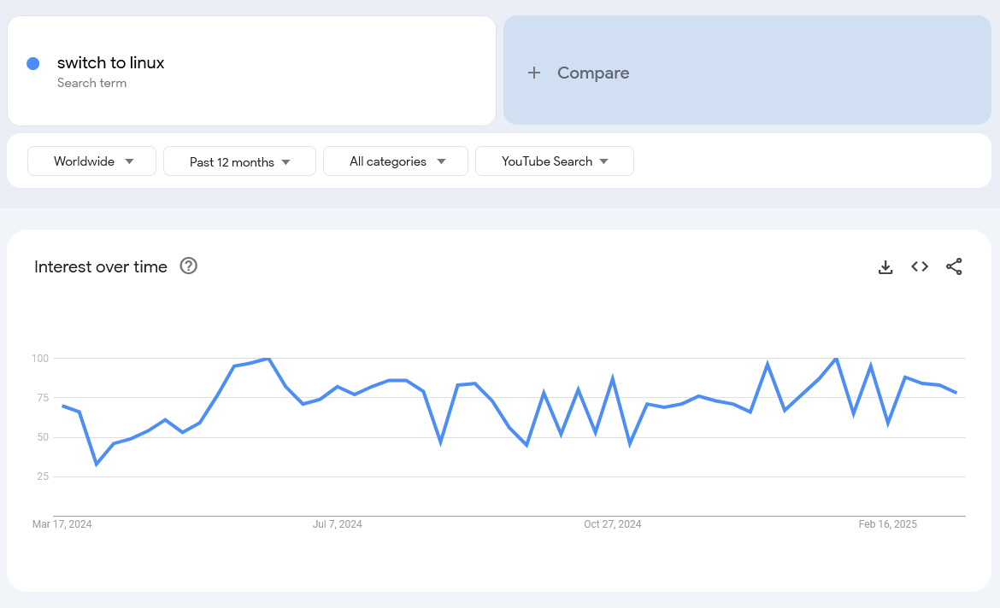
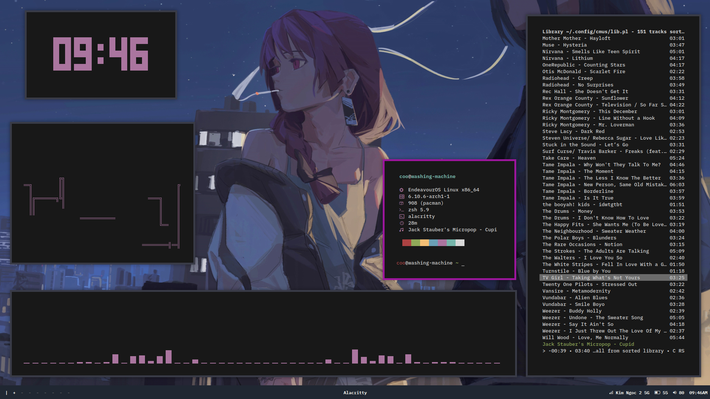
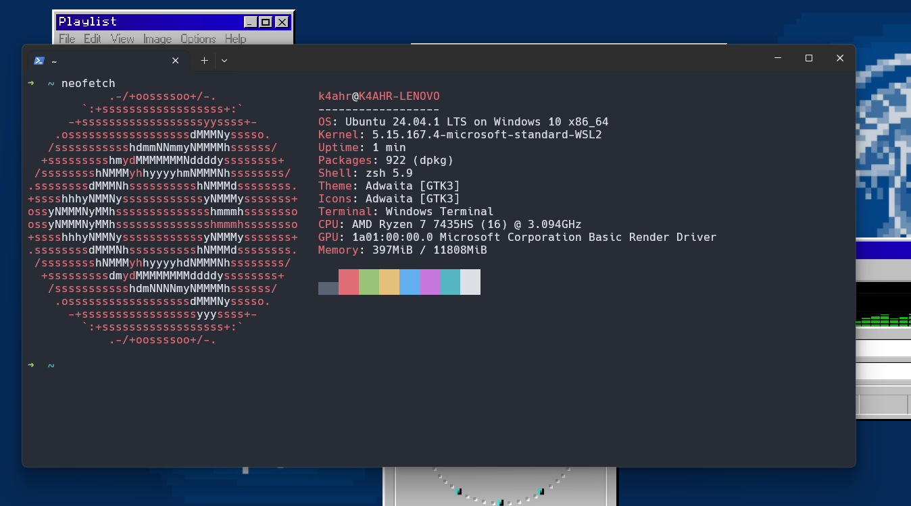

+++
title = "Linux, why you should use it, but also... not?"
description = "Wdym"
date = 2025-03-19
+++

Headlines has been crazed when Microsoft annouced the device requirements for Windows 11, right after Windows 10 end of support. This also caused the rise of medias and stuffs about making the switch to Linux. Like no joke, try to search the phrase "switch to linux" on YouTube, and you will see dozen, if not hundred of videos about making the switch from Windows to Linux.

For the most part, I do agree about the movement. Linux desktop has done a really good job in recent years, and it does fit the needs of most user bases, whether it's gaming, office work, or programming, because for most of it, every piece of software nowadays has its own open-sourced alternative. Of course, talking about gaming, some games do not run natively and require being run through some tools like Proton, but honestly, gaming on Linux has been performed seamlessly. That also explained many gaming consoles, like the Steam Deck, which uses a build of Arch Linux and still becomes one of the best-selling consoles worldwide. Not to mention that Linux is a free operating system, as in both price and freedom, hence you can even compile your own Linux kernel and build stuff from scratch.

And for this, I told one of my friends about switching to Linux when I heard about his abomination, an HP laptop, suffering from bad performance. So I installed EndeavourOS (fuck Ubuntu) for him, and a [rice made by stdrice](https://github.com/stdrice/pengurice). He did have some confusion at first when using it, but after almost a month, he said it was fascinating. He can use it without any problems and also utilize the terminal fluently. He even preferred apps and software that use CLI instead of traditional GUI-based software, quoting, "This shit looks clean as fuck." But after almost a year, I had to switch him back to Windows 10 LTSC due to a lack of proprietary software support that was required by his educational institution, poor gaming performance, and other problems related to troubleshooting and stuff. To be fair, he did really get into the Linux rabbit hole, learned to modify the pre-built config after his preference, and was even somewhat hesitant to switch back to Windows. The total amount of time he daily drove Linux was almost a year. Kudos to him for actually giving a shot at the beginning.

It's important to acknowledge that Linux might not be the perfect fit for everyone. There are certain scenarios where sticking with Windows or macOS could be more beneficial. For instance, if you rely heavily on specific software that is only available on Windows or macOS, switching to Linux might disrupt your workflow. It is explained for me why I can't use Linux daily drive like old time before, due to the need of software for my work like Adobe suites and some unsupported game like Valorant, because of its kernel-level anti-cheat.

And as for that, I have decided to stopped using Linux for daily drive after years, but rather treat it as an Operating System Labs for research, works and [CTFs plays](https://en.wikipedia.org/wiki/Capture_the_flag_(cybersecurity)), which I mostly use through virtual machine or [WSL](https://learn.microsoft.com/en-us/windows/wsl/).

I know it's not just about the lightweight and stuff; it's about freedom and privacy. But sometimes, you get what you paid for. I mean, at least if you are still concerned about privacy when using Windows, just install an LTSC version and use some GitHub tool like [privacy.sexy](https://privacy.sexy/) or [WinUtil](https://github.com/ChrisTitusTech/winutil) to debloat and remove all the telemetry. But at the end of day, its all about you, so choose whatever fit you best, don't force yourself to follow the movement if you're not comfortable about using Linux.