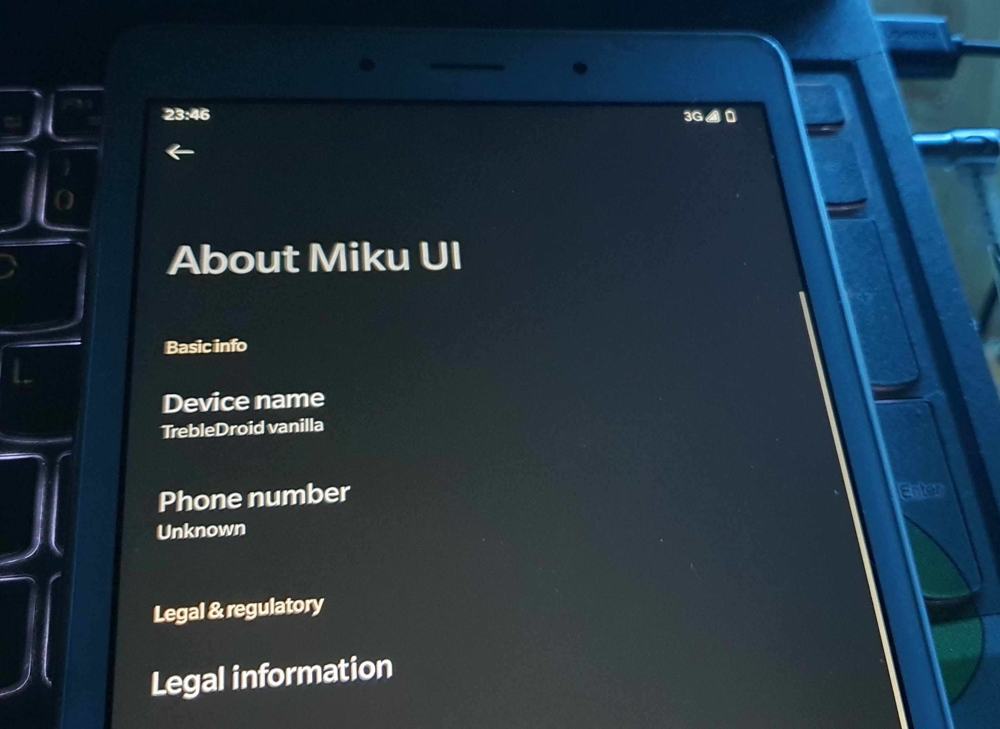
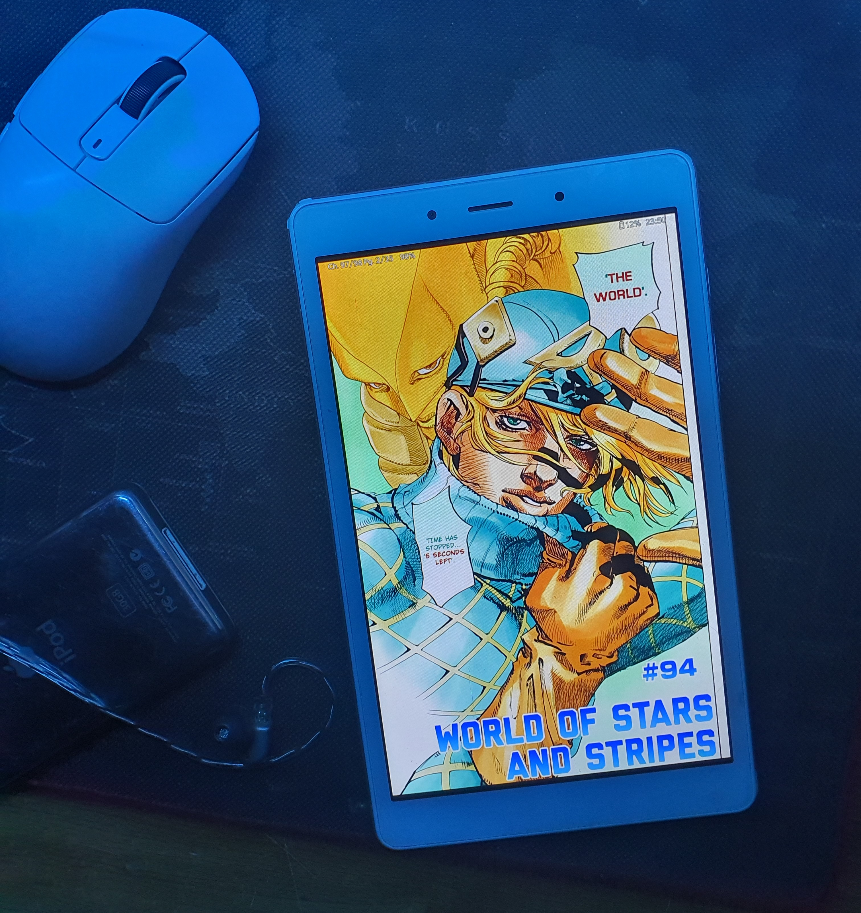

+++
title = "De-Google my tablet"
description = 'Having Google Service on a 2GB RAM device is suck'
date = 2025-01-27
+++

I got this tablet (thanks C00kiez), which is an Samsung Galaxy Tab A8 8.0 (2019), model SM-T295. At the time I received the tablet, it was runing Android 11, the highest official firmware from Samsung, so the device was at the worst performance, with just 32GB storage and 2GB RAM. 

So the first thing to do was to install a [custom ROM](https://en.wikipedia.org/wiki/List_of_custom_Android_distributions), for a better software exprience. Now of course, this is not a well known tablet in the market. In fact, till now I almost can't find any of stable built AOSP ROM for this tablet, so the second solution for this was to use an [GSI](https://developer.android.com/topic/generic-system-image). There are a lot of choice for [GSI build](https://github.com/phhusson/treble_experimentations/wiki/Generic-System-Image-%28GSI%29-list), but before that, I was using a GSI build of SuperiorOS that was built by [stdrice](https://stdrice.github.io) specifically for this SM-T295 model, and although the perfomance of the tablet on that built was really good, I switched to another GSI build called [Miku UI](https://github.com/xiaoleGun/treble_build_miku) that I built myself (don't try this), just for the fun of it, beside that it does not have many major impact compare to the old build. The build also does not included GApps, that are required for Google Services.

And I think that is the hardest part for the process. The rest is the setup that I use for my tablet. MOST of my application that I use here are open-sourced:

* Application store:
    - [Droid-ify](https://github.com/Droid-ify/client): A forked F-Droid, with more feature and Material UI built-in.
    - [Aurora Store](https://github.com/whyorean/AuroraStore): Google Play Store alternative, open-sourced and no Google Account required.

* Entertainment:
    - [LibreTube](https://github.com/libre-tube/LibreTube): An alternative frontend for YouTube, for Android. Kinda buggy tho.
    - [Metrolist](https://github.com/mostafaalagamy/Metrolist): Same with LibreTube, but for music.
    - [Kotatsu](https://github.com/KotatsuApp/Kotatsu): Manga reader for Android.
    - [ani-cli](https://github.com/pystardust/ani-cli): A cli tool to browse and play anime, required a terminal emulator like Termux.
    - [lichess](https://github.com/lichess-org/lichobile/): In case of offline, I can't beat Stockfish Lvl 3.

* Other general use:
    - [Firefox](https://www.mozilla.org/vi/firefox/): I haven't found a good Firefox's folk for mobile.
    - [fcitx5-android](https://github.com/fcitx5-android/fcitx5-android): Suprisingly they do have Unikey plugin for Vietnamese typing.
    - [Termux](https://github.com/termux/termux-app): An terminal emulator, I used to edit this website using Vim in Termux during military training.
    - [YAML Launcher](https://codeberg.org/ottoptj/yamlauncher): A more lightweight fork of OLauncher
    - [VLC](https://github.com/videolan/vlc): Regular media player for video and music.

That's about it! Well mostly I use the tablet for manga reading and listening to music, rather than using for other heavy work, but it's nice to have a de-Googled device that respects my privacy and runs smoothly.

