+++
title = "Bandit wargame của OverTheWire"
description = 'pretty cool game actually'
date = 2025-02-13
+++


Theo mô tả, Bandit là một trong những Wargame do cộng đồng [OverTheWire](https://overthewire.org/wargames/) cung cấp. Bandit hoàn toàn dành cho những người mới bắt đầu, vì nó giúp bạn tìm hiểu Linux bằng cách tương tác với giao diện. Đây sẽ là trải nghiệm và các cách giải của mình trong thời gian chơi Bandit của OTW. Trước khi bắt đầu, đây sẽ là những câu lệnh mình sẽ liên tục sử dụng qua quá trình giải trò chơi:
* ls: Hiển thị những file và folder đang nằm trong thư mục hiện tại
* cd: Thay đổi thư mục làm việc hiện tại
* cat: Xuất dữ liệu text ASCII của một file
* file: Xuất dữ liệu metadata của một file
* man: Sách HDSD cho mọi câu lệnh

Tạm thời vậy đã, ta bắt đầu thôi.

# **Level 0**

Để bắt đầu trò chơi, ta sẽ cần đăng nhập bằng SSH vào host **bandit.labs.overthewire.org**, port 2220, username và mật khẩu là "bandit0". 

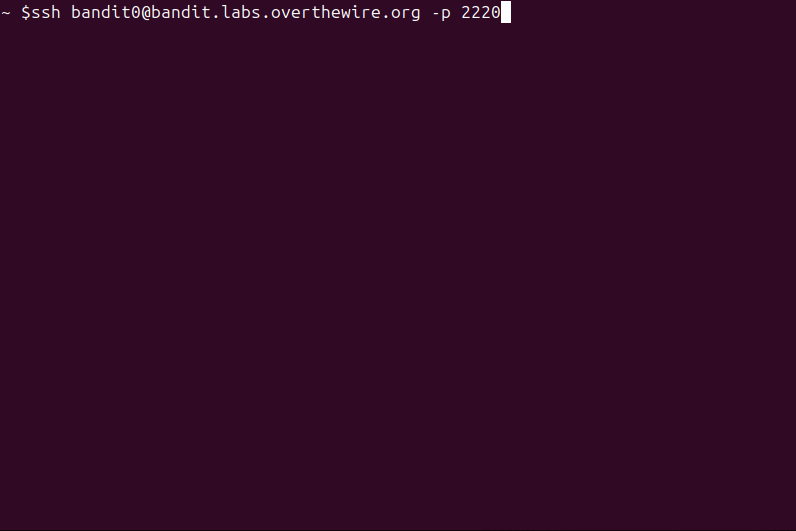

Cơ chế hoạt động của trò chơi này là có số lượng user từ "bandit0" đến "bandit34", với mỗi user tương ứng với một level. Và với mỗi user sẽ được giấu một mật khẩu hoặc những cách để có thể truy cập vào level tiếp theo.

Trong thư mục home của "bandit0", ta sẽ thấy một file readme chào mừng người chơi, cùng với password cho ta lên level tiếp theo.

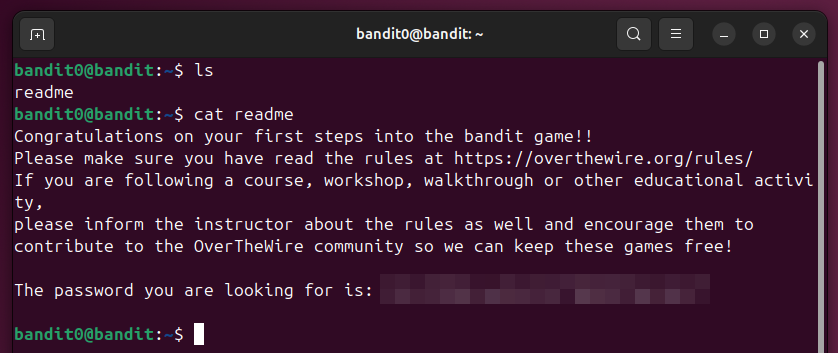

Một cái mình thấy hơi phiền là mình không thể đổi nhanh level bằng cách tiếp tục SSH server game bằng "localhost", nên ta sẽ phải logout SSH và đăng nhập vào session mới với user của level tiếp theo :v

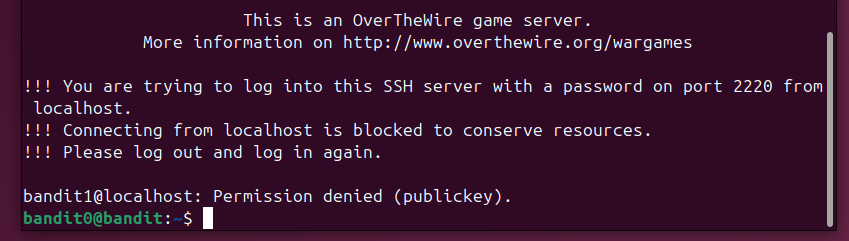

# **Level 1**

Mật khẩu tiếp theo chứa trong một file có tên là "-". Vì tên file có kí tự bắt đầu là một gạch ngang, nên khi khai báo tên file sẽ bị trùng với cách khai báo kèm flag của một số lệnh. Để xử lí, ta thêm ký hiệu "./" vào phía trước, vì "./" đại diện cho thư mục hiện tại mà ta đang hoạt động.

Ta sẽ chạy lệnh: `cat ./-`, và có được mật khẩu level 2.

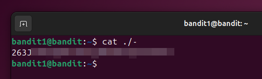

# **Level 2**

Mật khẩu chứa file tiếp theo chứa trong một file mang tên **"spaces in this filename"**. Vì file này có dấu cách trong tên, nên ta có hai cách để khai biến tên file:
* Gõ lên file cùng kí tự "\" trước khi gõ dấu cách
* Nhập full tên file trong dấu ngoặc kép

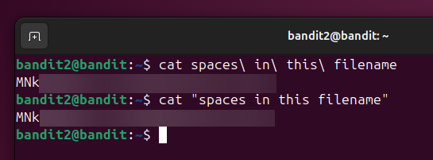

# **Level 3**

Mật khẩu lần này chứa trong một thư mục "inhere". Ta "cd" vào thư mục và chạy lệnh "ls" để xuất các file có trong thư mục nhưng không có kết quả. Có vẻ đây là một [dotfiles](https://wiki.archlinux.org/title/Dotfiles), với dấu chấm đầu tên file và bị ẩn mặc định. Ta sẽ chạy lại lệnh "ls" với flag -a để hiển thị cả dotfiles, và xuất hiện một file "...Hiding-From-You". Xuất dữ liệu bằng "cat ...Hiding_From_You":

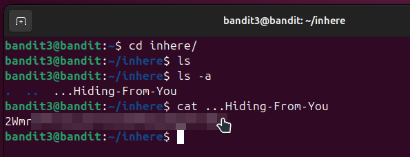

# **Level 4**

Lần này lại là một thư mục "inhere", nhưng chứa 9 file khác nhau, và theo OverTheWire nói rằng, mật khẩu nằm trong một file mà "con người đọc được". Ta có thể hiểu được sẽ chỉ có một file chứa dữ liệu đọc được như ASCII hoặc Unicode. Cách đơn giản nhất là check từng file, nhưng ta không thể làm thế nếu có quá nhiều file. Ta có 1 cách khác là sử dụng lệnh "file" lên tất cả các files trong thư mục "inhere"

Ta sẽ chạy lệnh "file ./*" và lệnh sẽ áp dụng lên mọi files trong thư mục, và ta thấy tất cả các file đều chỉ ra kiểu dữ liệu chung là "data", trong khi "-file07" chứa dữ liệu ASCII mà ta đang tìm.

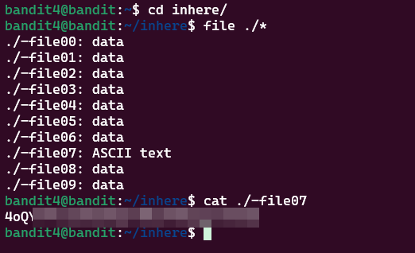

# **Level 5**

Vẫn là thư mục "inhere", nhưng khi chạy "ls -la", ta thấy folder lần này chứa hơn 80 files riêng biệt:
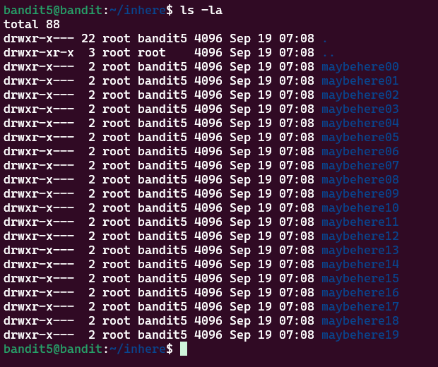

Theo như đề bài, file lần này cụ thể rằng có dung lượng là 1033 bytes, không thực thi được và con người có thể đọc được. Bỏ qua yếu tố "đọc được", ta sẽ sử dụng lệnh sau:

<p style="text-align:center"><b>find ! -executable -size 1033c</b></p>

"! -executable" sẽ bỏ qua tất cả các file có thể thực thi, và "-size 1033c" sẽ cụ thể những file mang 1033 bytes dữ liệu. Và ta sẽ thấy file chúng ta cần tìm.

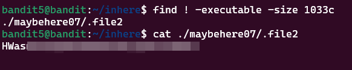

# **Level 6**

Lần này theo đề bài, mật khẩu chứa trong một file nằm **"somewhere on the server"** (vl thật), và file mang các điều kiện sau:
* Sở hữu bởi user **bandit7**
* Sở hữu bởi group **bandit6**
* Chứa 33 bytes dữ liệu

Vì file lần này nằm ở đâu đó trong server, ta sẽ phải chuyển thư mục hoạt động hiện tại về thư mục gốc với lệnh "**cd /**", và ta sẽ dùng lệnh **find** một lần nữa, với hai flag là "-user" và "-group" để tìm file có những phân quyền cụ thể như trên:

<p style="text-align:center"><b>find -user bandit7 -group bandit6 -size 33c</b></p>

Output đưa ra khá nhiều lỗi do một số file ta không check được, nhưng trong đống output đó vẫn có một kết quả đưa ra thành công:

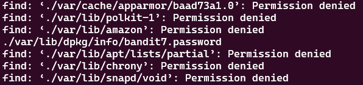
<p style="text-align:center"><b>./var/lib/dpkg/info/bandit7.password</b></p>

Và tất nhiên khi ta dùng lệnh cat lên file này, ta có mật khẩu cần tìm cho level tiếp theo.

# **Level 7**

Mật khẩu tiếp theo nằm trong file "data.txt", bên cạnh cụm từ "millionth".
Khi cat file này, ta thấy có hàng nghìn kết quả khác nhau, với một password khác nhau nằm cạnh một cụm từ ngẫu nhiên. Để tìm nhanh dòng text có cụm từ "millionth", ta sử dụng thêm "grep" ngay sau lệnh **cat**, và có ngay dòng text chứa password ta cần tìm:

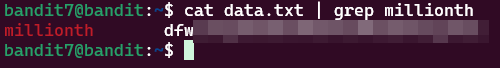
<p style="text-align:center"><b>cat data.txt | grep millionth</b></p>


# **Level 8**

Mật khẩu tiếp theo nằm trong file "data.txt" và chỉ xuất hiện một lần. Vậy có nghĩa là trong file có những mật khẩu fake lặp lại nhiều lần, và mật khẩu ta cần tìm chỉ hiện 1 lần. Một cách rất đơn gian là ta sử dụng thêm lệnh "uniq -u" kèm với lệnh **sort** nhằm lọc hết ra tất cả những kết quả bị lặp.
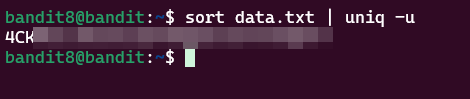
<p style="text-align:center"><b>sort data.txt | uniq -u</b></p>

# **Level 9**

Một lần nữa, trong file "data.txt", nằm cạnh ký tự "=". Mình sẽ sử dụng lệnh **string** để tìm cụm ký tự chứa password, kèm them lệnh **grep** để lọc ra những chuỗi cụm mà chứa "=".

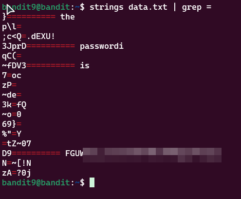
<p style="text-align:center"><b>strings data.txt | grep =</b></p>

# **Level 10**

Vẫn trong một file txt, nhưng lần này file đã được encode sang base64. Ta hoàn toàn có thể decode ngược lại bằng câu lệnh "base64" và flag **-d** ngay sau khi **cat** file text đã decode.

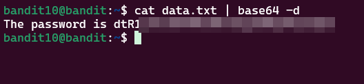

# **Level 11**

data.txt, "where all lowercase (a-z) and uppercase (A-Z) letters have been rotated by 13 positions". Có vẻ mật khẩu lần này đã bị mã hoá qua định dạng ROT13. Vì mình không biết có câu lệnh nào decode ROT13 trên Linux không, nên mình chỉ đơn giản là **cat** file text và decode bằng [cyberchef.io](https://cyberchef.io).

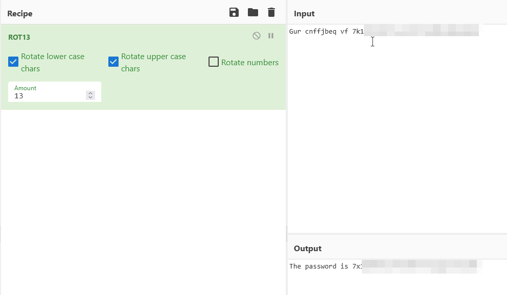

# **Level 12**

Lần này chúng ta có một đề bài khá hay. Mật khẩu được chứa trong 1 file **data.txt**, theo OverTheWire cho rằng đây là [Hex dump](https://en.wikipedia.org/wiki/Hex_dump) của một file mà trước đó đã nén liên tiếp nhiều lần, và lần này ta cần sử dụng folder **/tmp** để chứa tạm thời công việc giải mã của mình.

Đầu tiên mình sẽ tạo một folder trong **/tmp** bằng lệnh **mktemp -d** để có một folder tạm thời, và mình sẽ copy file **data.txt** vào trong đó.


Sau đó mình sẽ decode lại file **data.txt** từ dạng file Hex_dump bằng câu lệnh **"xxd -r data.txt data"**. Sử dụng lệnh **file** để tìm ra định dạng của file **data** đã decode, ta thấy được đây là một file mang dữ liệu là "data: gzip compressed data", tức là 1 file nén đuôi **.gz**. Mình sẽ đổi tên file này để mang đuôi **.gz** và giải nén file này dùng lệnh **gzip**:
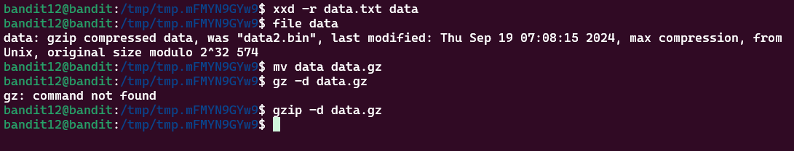


Bởi vì file này đã bị nén ***LÊN ĐẾN 7 LẦN***, nên mình đã phải lặp lại quá trình này đúng 7 lần: check định dạng, đổi tên, giải nén; và thậm chí còn nén lên đến 3 định dạng khác nhau là **.bz2**, **.gz** và **.tar**, *~~nên là ông nào mà nghĩ ra cái level này ra ngoài đường cứ cẩn thận đấy..~~*
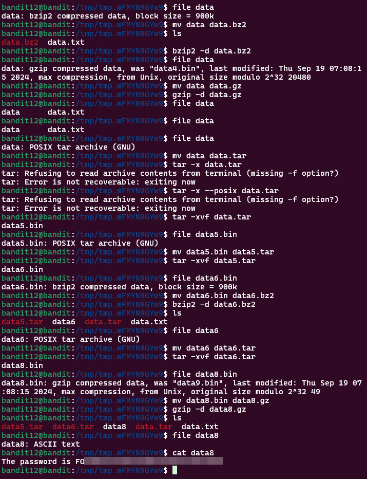

Và sau khi giải nén toàn bộ thì ta lại qua về một file text ASCII, và đơn giản là chứa password ta cần tìm.

# **Level 13**

Lần này password cho level tiếp theo được lưu trữ tại **/etc/bandit_pass/bandit14** và chỉ có level tiếp theo truy cập được. Chính vì vậy, đề bài cho rằng ta level tiếp theo ta sẽ truy cập bằng một key SSH cho level 14 được cấp. 

Nhưng từ đây khi ta check **/etc/bandit_pass**, ta sẽ thấy tất cả password của toàn bộ 34 level được chứa trong thư mục này, và chỉ truy cập được tuỳ vào user của level nào mà ta đang hoạt động. Điều này sẽ có thể giúp ích cho việc giải các level tiếp theo.

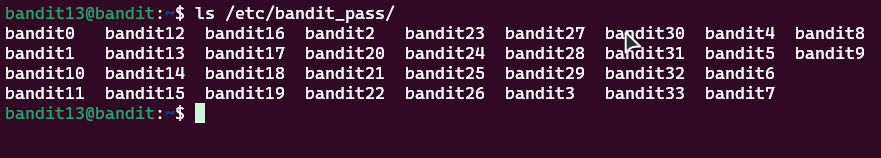

Quay trở lại level 13, chúng ta sẽ truy cập bằng một SSH key được cấp trong thư mục hiện tại, mang tên file là **ssh.private**, và sử dụng nó bằng cách tên flag **-i** trong câu lệnh SSH của chúng ta.

<p style="text-align:center"><b>ssh -i sshkey.private bandit14@bandit.labs.overthewire.org -p 2220</b></p>

# **Level 14**

Mật khẩu tiếp theo có thể kiếm được bằng cách cấp password của level hiện tại vào port 30000 của **localhost**.

Để hoàn thành được level này, ta cần sử dụng câu lệnh **nc** (netcat). Để cho dễ hiểu, **netcat** cho phép gửi và nhận dữ liệu giữa các máy tính qua các port khác nhau, có thể dùng để đơn giản giao tiếp hoặc truyền file.

Trước khi ta sử dụng, vì level này ta đăng nhập thông qua một file sshkey, nên giờ ta sẽ phải lấy mật khẩu của level này tại **/etc/bandit_pass/bandit14** như đã nói từ trước. Sau đó ta sẽ tạo kết nối vào localhost qua port 30000, và cấp password của tầng này. Khi đó ta sẽ nhận lại phản hồi thành công, kèm theo password cho tầng tiếp theo. 8xCjnmgoKbGLhHFAZlGE5Tmu4M2tKJQo

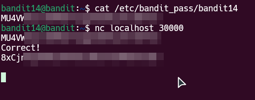

# **Level 15**

Giống level trước, nhưng qua port 30001 kèm mã hoá SSL/TLS. Lần này ta sẽ dùng lệnh **openssl s_client**, hoạt động giống **netcat** nhưng cho phép ta sử dụng mã hoá SSL/TLS, kèm theo kiểm tra một số chứng chỉ kết nối, v.v..

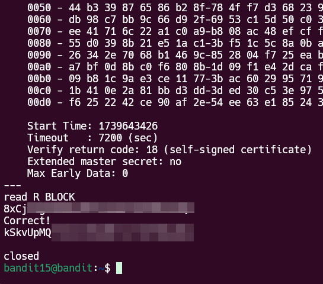
<p style="text-align:center"><b>openssl s_client localhost:30001</b> và cấp password level trước</p>

# **Level 16**

Lại giống level trước, nhưng lần này ta phải tự tìm port trong khoảng 31000 đến 32000. Ta sẽ dùng **nmap** để tìm.

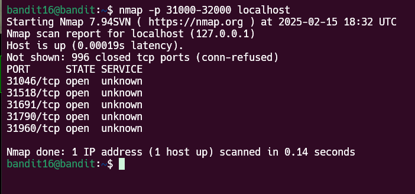

<p style="text-align:center"><b>map localhost -p 31000-32000</b></p>

Kết quả trả về 5 port mở, test từng port bằng **openssl s_client**, ta thấy port 31790 phản hồi do có TLS/SSL. Nhưng khi cung cấp password level trước, hệ thống trả về "KEYUPDATE". Đề bài có nhắc đến vấn đề này và gợi ý check **man page** của **openssl s_client**, rằng vấn đề này xảy ra do xung đột với việc mật khẩu có chữ k ở đầu hay cái gì đấy mình chả biết. Cách khắc phục đơn giản là thêm flag -quiet.

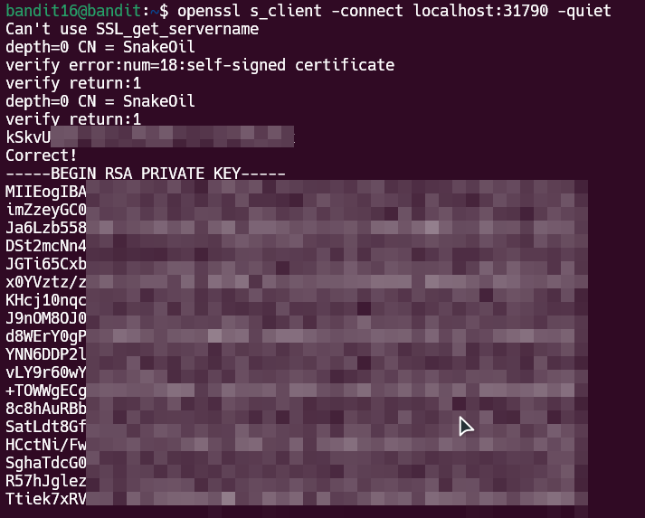

<p style="text-align:center"><b>openssl s_client -connect localhost:31790 -quiet</b></p>

Và vì một lý do nào đó mà hệ thống cho ta một đoạn key SSH thay vì password. Nên mình phải thoát SSH và sao chép key thành file vào hệ thống để đăng nhập.

# **Level 17**
Màn này khá đơn giản, 2 files là password.old và password.new. 2 file sẽ chỉ khác nhau ở 1 dòng, và dòng nó nằm trong password.new chính là password cho level tiếp theo. Ta sẽ dùng lệnh **diff**.

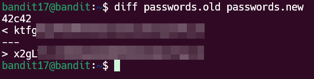

# **Level 18**
Khi đăng nhập vào level này, ta sẽ có kết quả ""Byebye!" và ngay lập tức bị đạp ra khỏi SSH. Theo đề bài, password nằm ngay trong 1 file **readme**, trong folder home của level này. Ta có thể vớ nhanh file **readme** bằng cách thêm lệnh đọc file **readme** sau lệnh SSH.

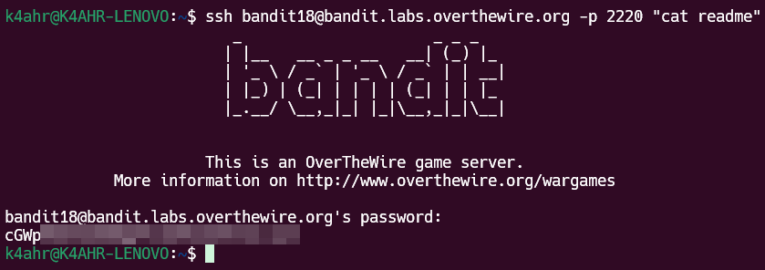

# **Level 19**
Ta được cấp 1 file binary trong home directory. Kiểm tra bằng **ls -la**, ta có kết quả sau:

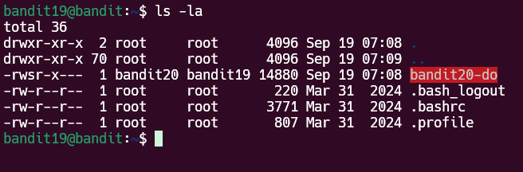

Ta thấy được rằng **bandit19** có thể thực thi file, nhưng owner file là bandit20. Khi thực thi thử file, ta có kết quả sau:
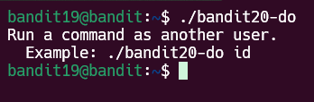
Vậy có nghĩa là file này ta thực thi được tại level 19, nhưng nó sẽ chạy lệnh tiếp theo với quyền của bandit20. Lợi dụng điều này và ta sẽ dùng **cat** để lấy password của bandit20 tại **/etc/bandit_pass**:

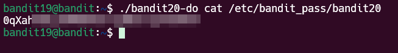

# **Level 20**

Level này khá lằng nhằng, ta phải tự mở một port bất kỳ bằng **netcat**, sử dụng một file binary được cấp trong folder home tên lầ "suconnect" kèm port mà ta mở, rồi cấp password level. Khi đó tại **netcat** ta mở trước đó, sẽ xuất ra password cho level tiếp theo.

Vì ta cần làm hai tác vụ một lúc, ta sẽ sử dụng **tmux** để hoạt động hai session cùng một lúc. Đây là giải pháp của mình:
* Mở **tmux**
* Tổ hợp CTRL + B, sau đó C để tạo session thứ 2
* Tổ hợp CTRL + B kèm 0 hoặc 1 tuỳ session
* Session đầu ta mở một port bằng **netcat**: `nc -l -p 1234`
* Session sau ta chạy file binary: `./suconnect 1234`
* Quay lại session **netcat**, ta cấp password level trước đó và được trả về với password level tiếp theo.

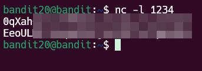


# **Level 21**
Một tác vụ được chạy liên tục tại **/etc/cron.d/**. Ta sẽ `cd` vào thực mục này và thấy 1 loạt script cronjob khác nhau. Vì level tiếp theo là 22, nên mình đã check file "cronjob_bandit22". Bên trong file chứa 1 lệnh được chạy liên tục theo perm của bandit22. `cat` thử file đấy và thấy rằng file password của bandit22 ở **/etc/bandit_pass/bandit22** được copy vào một file ở /tmp. `cat` file đó và ta thấy mật khẩu của level tiếp theo.
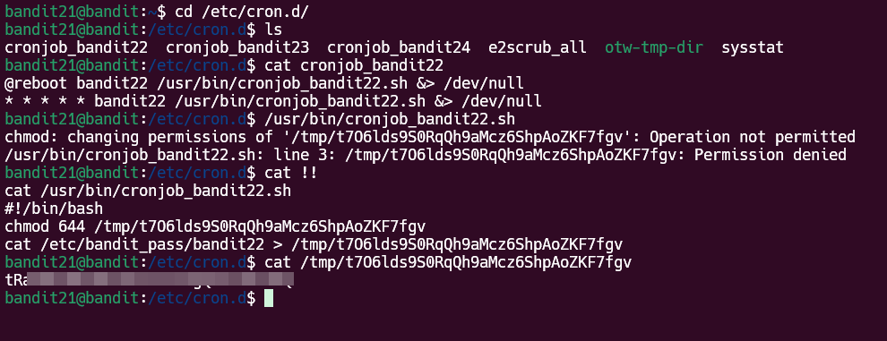


# **Level 22**

Level này khá tương tự level trước, nên mình `cat` và chạy thử file "cronjob_bandit23".
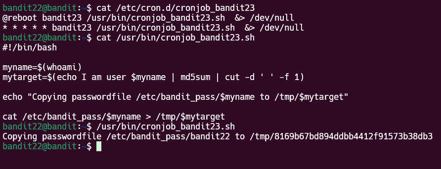

Ta sẽ cần phân tích file này. Giá trị của lệnh "whoami" sẽ được đưa vào biến "myname", và sử dụng "myname" để chạy một lệnh có kết quả lưu tại "mytarget". Vì script crobjob khi chạy, giá trị của "whoami" là bandit22, và password của bandit22 được lưu tại 1 thư mục mang tên là giá trị của "mytarget", khi user chạy là bandit22. Vì file cronjob chạy tự động ở bandit23, tức có nghĩa cũng đang có một file mang tên là giá trị của "mytarget" khi user là bandit23. 

Giải pháp khá đơn giản, ta chỉ cần tìm giá trị của "mytarget" khi user là bandit23, bằng cách tự chạy câu lệnh xuất giá trị "mytarget", với việc tự thay "whoami" bằng bandit23. Từ đó ta sẽ tìm file mang tên giá trị ta có được trong **/tmp** và `cat` file đó.
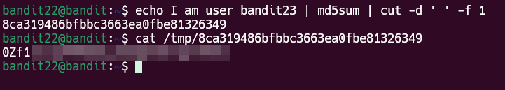

# **Level 23**

Cũng là crobjob, mình `cat`, chạy thử các kiểu "cronjob_bandit24".
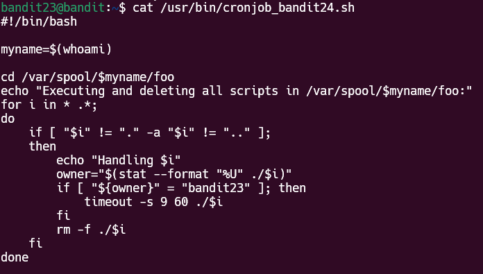

Để hiểu đơn giản, script này sẽ chạy và đồng thời xoá hết tất cả các script nằm trong **/var/spool/bandit24/foo**, do script này chạy trong user bandit24 cùng perm của bandit24 luôn. Và điều đặc biệt là trong script có lọc và chỉ chạy các script mà owner là bandit23.

Cách xử lí bây giờ là tạo một script mà sẽ copy pass của level tiếp theo vào 1 file trong **/tmp**, sau đó đưa script đấy vào trong **/var/spool/bandit24/foo** và chờ nó được chạy tự động bởi user bandit24. Đây là list các bước làm:
* Tạo 1 folder để làm việc bằng `mktemp -d` tại `/tmp`
* Tạo 1 file script mới bằng `vim hack.sh`. Đây sẽ là nội dung bên trong script:

```
#!/bin/bash'
cat /etc/bandit_pass/bandit24 > /tmp/bandit24_pass'
```

* Lưu script lại và chạy **chmod +x hack.sh** để file script có thể chạy được
* Copy script vào **/var/spool/bandit24/foo**, ngồi chờ 1 lúc hay gì đấy và check file **/tmp/bandit24_pass**

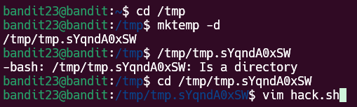
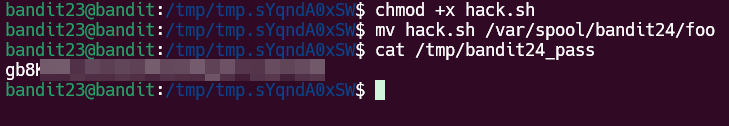


# **Level 24**

Level tiếp theo quay trở về với **netcat**, tại port 30002. Lần này ta cần nhập password kèm 1 đoạn mã PIN 4 chữ số. Đề bài gợi ý rằng ta có thể brute-force phần mã PIN này. Vậy thì ta sẽ tạo 1 script brute-force trong **/tmp** và chạy thôi.

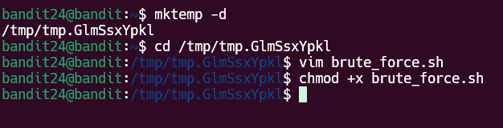
<p style="text-align:center"><b>Tạo script</b></p>

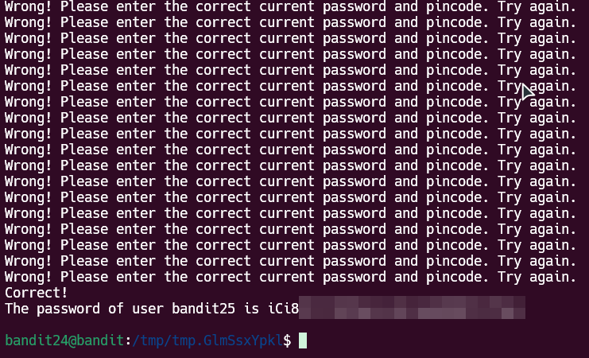
<p style="text-align:center"><b>Brute-force goes brrrrrrrrrrr</b></p>

*Note: nếu bạn mò được, bạn sẽ có thể tìm được script mình sử dụng, còn mình sẽ không show script của mình tại đây do script của mình đã gây overload server.*
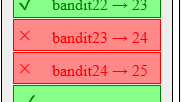

# **Level 25**

Level tiếp theo hoạt động hơi kì. Ta được cấp ngay SSH key cho level 26, nhưng khi đăng nhập vào level tiếp theo, ta bị hệ thống đẩy ra do cách cài đặt shell cho level này, cụ thể là với kết quả trả ra là "Connection to bandit.labs.overthewire.org closed.".

Đầu tiên mình sẽ kiểm tra shell của bandit26 qua file **/etc/passwd**, thấy được rằng bandit26 đang sử dụng một shell tên là **showtext**. **cat** thử file shell này, ta thấy ở trong file, hệ thống chạy một lệnh tên là `more` vào một file **text.txt**, kiểm tra thử cả file text này nhưng có vẻ level này không có perm, nên ta bỏ qua file này.
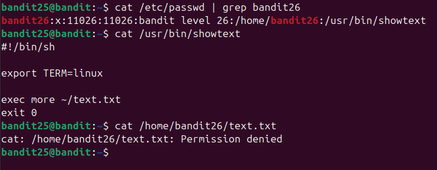
Nói thêm về `more`, là một lệnh để xem file mà có thể tương tác được. Một tính năng của `more` đó chính là nó sẽ đổi từ tương tác thông thường sang chế độ command khi mà terminal xuất ra quá bé. Mình check thêm `man` page của `more` thì thấy có một command là `v`, sẽ đưa chúng ta vào editor mode, và mặc định cho chế độ này sẽ sử dụng `vim` là editor. 
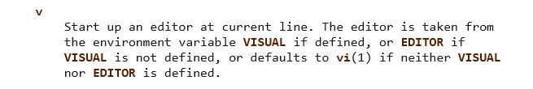

Vậy là mình cho bé cửa sổ lệnh, SSH vào level 26 và spam `v`, cuối cùng cũng được đưa vào editor mode là `vim`. 
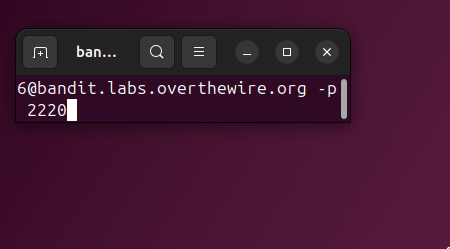

Từ trong này, vì mình đang ở level 26, mình có thể dùng `vim` để mở file chứa password mặc định của các level tại `/etc/bandit_pass/bandit26` bằng lệnh `:e`. Thực ra thì việc lấy password cho level 26 là optional, nhưng mình muốn lưu trữ tất cả password của mọi level, mặc dù OverTheWire nói rằng họ thường thay đổi password :v. 

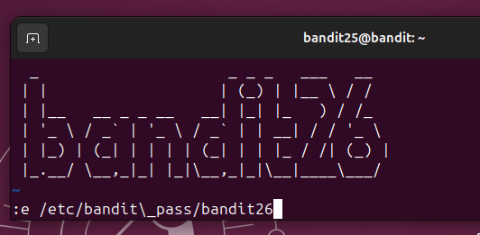

Sau khi lấy được password cho level 26, mình sẽ thay đổi shell hiện tại là :set `shell=bin/bash`, và truy cập lại về shell bằng `:shell`.

# **Level 26**

Vậy là đã vào được level 26, `ls` thì thấy có file binary giống với level 19 trước đó, nên ta thực hiện tương tự và lấy password cho level tiếp theo.
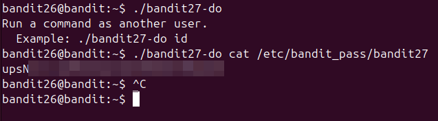


# **Level 27**
Level 27 không có gì khó. Ta được cấp 1 git repository, và việc của ta chỉ là clone cái repo đó vào trong 1 folder ở `/tmp`. Repo chứa một file readme, `cat` thử file đấy là ta có password cho level tiếp theo.

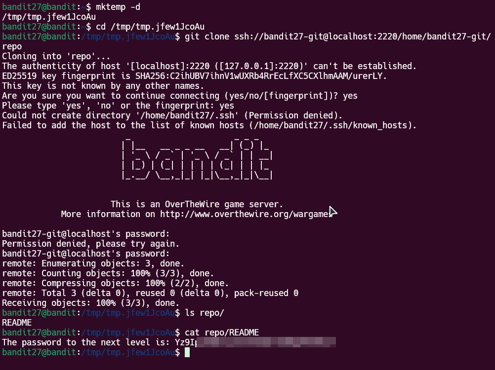

# **Level 28**

Giống level trước, clone và check file README, thì lần này password không nằm trong này. Mình dùng `ls -la` để check nếu có file ẩn thì thấy thư mục `.git`. Từ đó mới nhớ ra mình có thể check commit log của repo này.
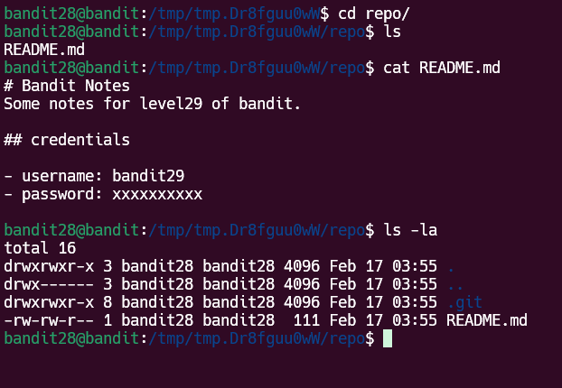

Sử dụng lệnh `git log`, mình thấy có một commit tên là `add missing data`, nối sau đó là commit `fix info leak`. Có thể hiểu được `fix info leak` là commit xoá password, tức commit trước đó chứa password cho level tiếp theo, mình check bằng lệnh `git show <commit_id>`.
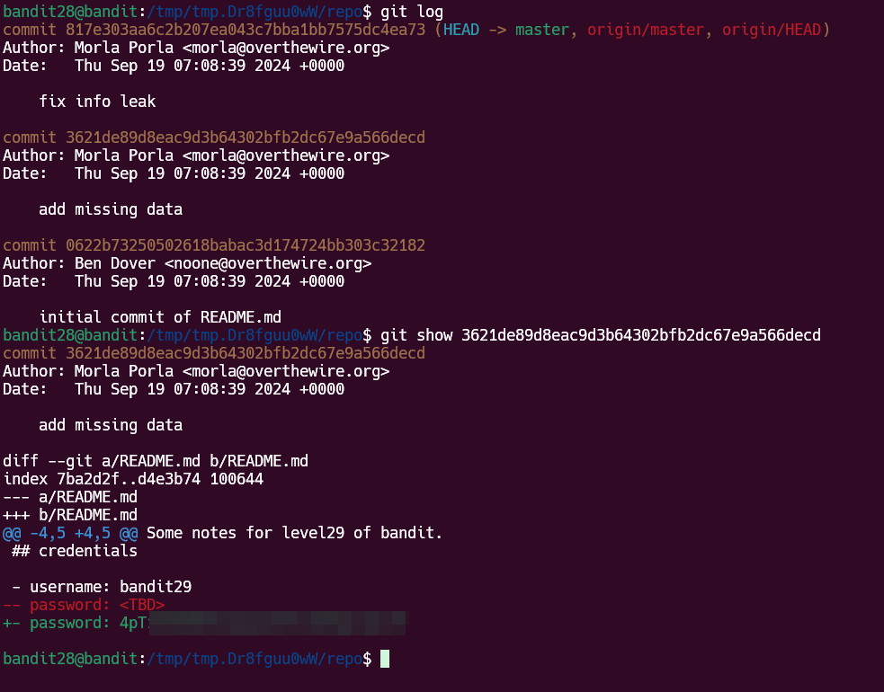

Từ đây mình cũng có một lời khuyên, rằng nếu các bạn mà có leak info nào đó không mong muốn trên 1 cái repo nào đó như ở GitHub hay Codeberg, thì hoặc là bạn private cái repo đấy, hoặc là bạn xoá hẳn repo đấy luôn ¯\\_(ツ)_/¯ .

# **Level 29**

Lại giống level trước, clone và `cat` file README, không có password. Chạy `git log` thì thấy có một branch được merge từ orgin/HEAD sang origin/master. Vậy có nghĩa là cái repo này có nhiều branch hơn bình thường, nên mình check bằng lệnh `git branch -a` và thấy một vài branch khác nhau. Mình check thử nhánh `dev` bằng `git checkout dev` và `cat` lại file README của nhánh này, thì thấy được password tiếp theo.

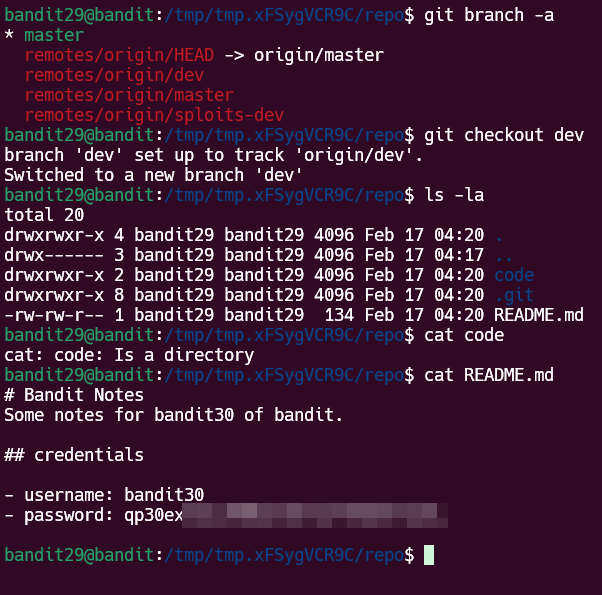

# **Level 30**

Giống level trước, `clone` và `cat`, ta có một dòng là **"just an epmty file... muahaha"** bị sai chính tả, thua....

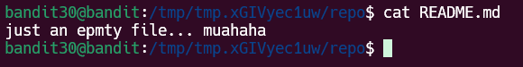

Check git log và branch thì chỉ có hai branch đã merge với nhau nên không có gì đặc biệt.

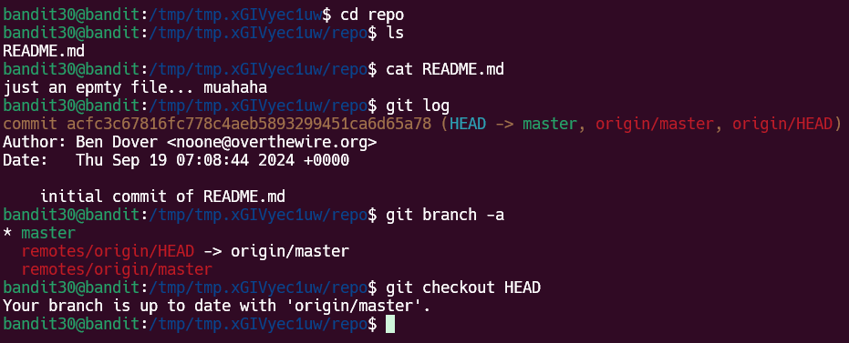

Ta còn có một lệnh nữa là `git tag`, dùng để check những commit được tag lại cụ thể. Và sử dụng, mình thấy có một tag thê là **secret**, check bằng lệnh `git show`.

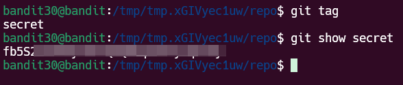


# **Level 31**

Vẫn vậy, clone và check README, ta có một nhiệm vụ là push một file text với nội dụng 'May I come in?' lên repo.
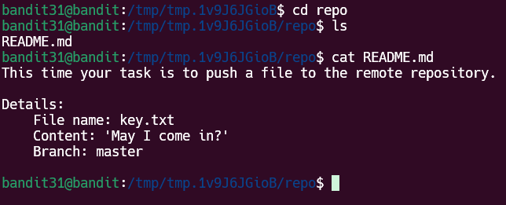

Với một người đã hoạt động với lệnh `git push` nhiều lần với trang web của mình (open-sourced under the MIT License btw), việc đưa một file vào repo, tạo commit và push lên khá là đơn giản. Đây là quá trình của mình:
* Tạo file **key.txt** bằng lệnh `echo 'May I come in?' > key.txt`
* Thêm file key vừa tạo vào commit bằng `git add -f key,txt`
* Tạo commit `git commit -a` và nhập nội dung của commit vào trong text editor được prompt lên
* Đẩy file key lên repo bằng `git push -u origin master`

Và mặc dù repo từ chối push của chúng ta, mình lại nhận được kết quả trả về chứa password cho level tiếp theo.

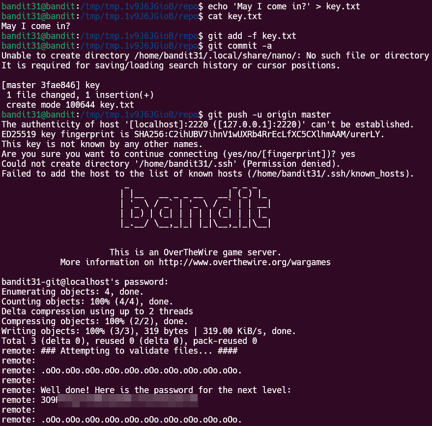

# **Level 32**

Kết thúc về git, đăng nhập vào level này, ta lại được đưa vào một shell kỳ lạ gì đấy tên là "UPPPERCASE SHELL". Đoán rằng có thể các lệnh ở shell này cần phải viết hoa nhưng có vẻ không phải.

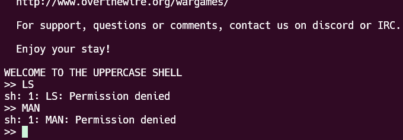

Sau một lúc tìm hiểu thì có vẻ Linux có nhận biến $ là các ký tự uppercase, nên mình đã thử `$0`, hay còn được biết đến chính là một biến nối đến shell thông thường. Đó cũng chính là lí do thông thường terminal của Linux hay có dấu $ nằm ở sau hostname.

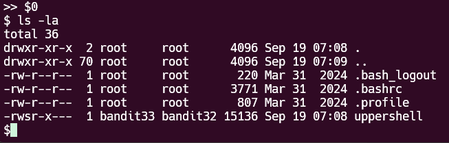

Quay lại các bước truyền thống, `ls -la`, thì tự dưng mình lại thấy cái UPPPERCASE SHELL lại mang owner là **bandit33**. Check thử xem user hiện tại là gì bằng lệnh `whoami`, kết quả trả về là bandit33. Tận dụng điều này, mình lấy password của level tiếp theo tại `/etc/bandit_pass/bandit33`

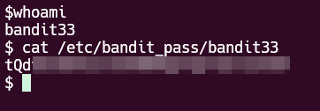

# **Level 33**

Vào khoảng thời gian mình viết write-up này, có vẻ như hiện tại đây là level cuối cùng của trò chơi bandit.

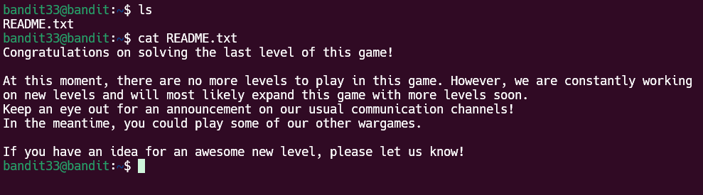

Đây là đánh giá nhanh một số level theo cảm nhận của mình:
* Level dễ nhất: 1 - Chắc chắn rồi
* Level khó nhất: 23 - Cần có kỹ năng phân tích tốt
* Level yêu thích của mình: 31 - Những câu lệnh sử dụng khá là có ích khi hoạt động nhiều với `git`
* Level mình ghét nhất: 12 - Tuy không khó nhưng level này nhất lằng nhằng và cồng kềnh không cần thiết
* Level độc nhất: 20 - Cần kỹ năng tư duy logic cùng với việc làm đa tác vụ

Như mình đã nói, bandit mình đánh giá là một trò khá là hay cho những ai muốn học tập và làm quen, tìm hiểu về Linux, cũng như là những kỹ năng khác liên quan đến CNTT như mạng máy tính, phân quyền, git, v.v..

[File Password](https://bin.disroot.org/?3fdc0550b637af9d#7UDbCtZvj7pTcziUXwfMAPMDz48feoexyjK2w6178tjN) của từng level bandit trên (khá chắc là sẽ sớm bị thay đổi lmao). Mật khẩu để truy cập file là bài hát có nhiều view nhất của một ban nhạc tan rã năm 2023.

Nếu bạn có gì thắc mắc hoặc muốn đóng góp, hãy gửi cho mình tại: k4ahr@getgoogleoff.me


* [Bandit by OverTheWire](https://overthewire.org/wargames/bandit/)

<p style="text-align: center;">
  
  
</p>