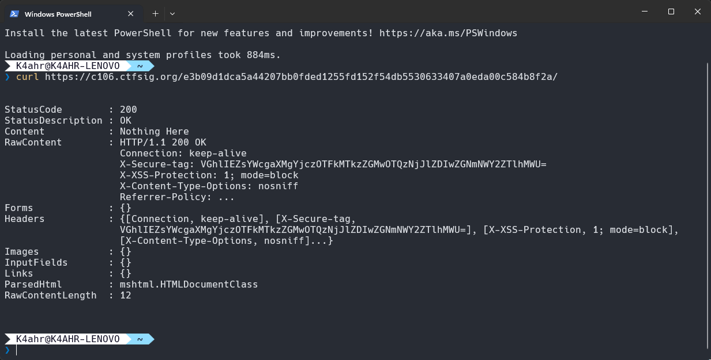
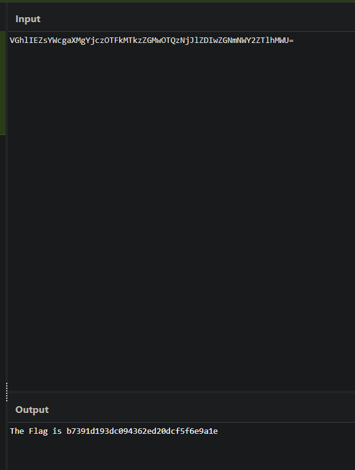
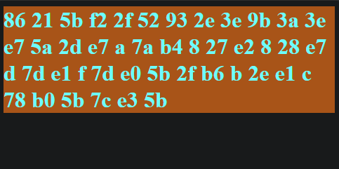

+++
title = "Giải CTF cho nữ ?"
description = 'khó nói'
date = 2025-08-18
+++

FIRST Challenge là giải CTF cho các bạn tài năng nữ trẻ của khu vực ASEAN. Theo lý thuyết thì mình không phải nữ, nhưng cảm ơn bạn @liminlimit.nt vì đã lấy cho mình đề của giải này, và từ đó mình đã có thử giải 2 trong tổng số 3 bài web của giải này, mặc dù vì lý do nào đó mà bài thứ 3 đã bị gỡ :v.

# 1. Web Has More Content

Ta có địa chỉ vào instance đầu tiên, khi truy cập ta sẽ thấy dòng "Nothing Here" xuất hiện. Vậy là mình thử `curl` vào địa chỉ instance này, và ngay lập tức ta thấy được 1 đoạn text được mã hoá base64 trong header của trang web này. 


Decode đoạn text này và ta có một chuỗi là "The Flag is b7391d193dc094362ed20dcf5f6e9a1e".



# 2. Nice Colors

Vào trong instance, ta có 1 đoạn text cipher được set với 1 cái màu background, có vẻ là random tuỳ thời điểm giải bài này. Bài này thực chất là một bài crypto, với một cái cipher XOR ta có ngay khi vào instance, và theo đề bài thì ta sẽ lấy hex code của màu background làm key.



Sử dụng cái script mình tạo từ chatgpt và mình lấy được flag từ cipher XOR.


```
# Cipher text from the challenge
cipher_hex = "ENTER_CIPHER" # <-- the cipher hex

# Background color from the webpage
bg_color = "HEX_COLOR"   # <-- the color hex

# Convert color to key (blue channel)
key = int(bg_color[-2:], 16)

# Decode
cipher_bytes = cipher_hex.split()
decoded = [chr(int(cipher_bytes[i], 16) ^ key) for i in range(2, len(cipher_bytes), 3)]
decoded_str = "".join(decoded)

print("Decoded:", decoded_str)

```

