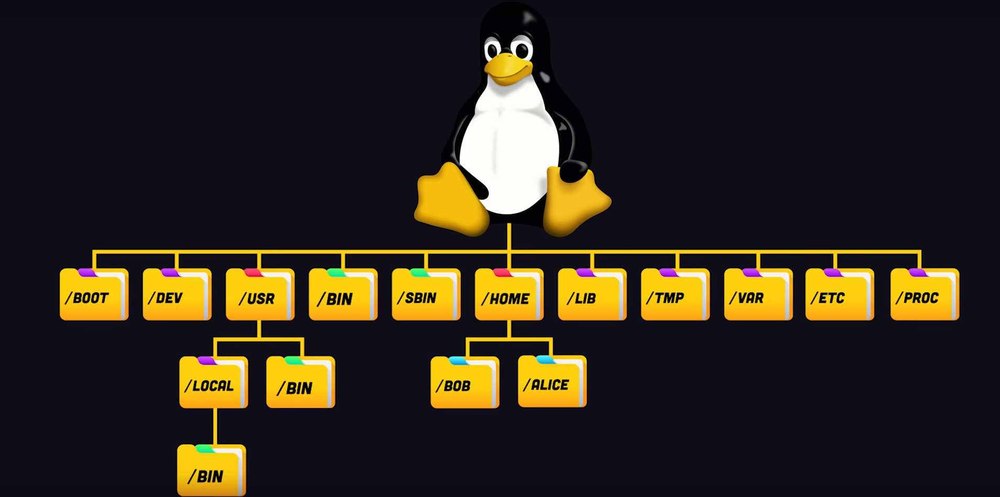
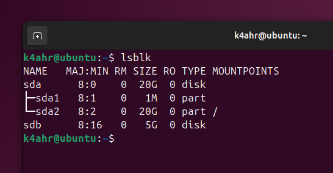
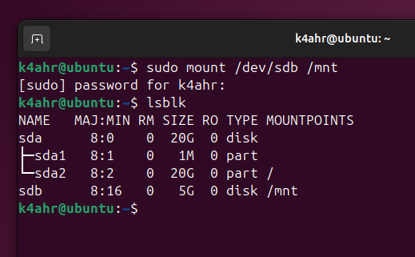
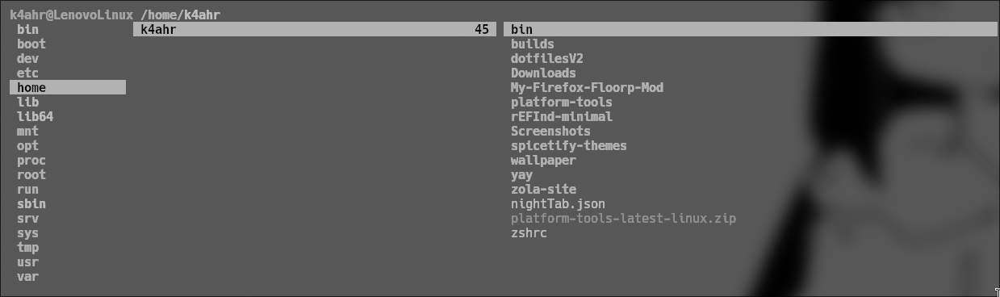
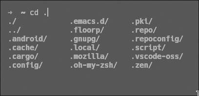
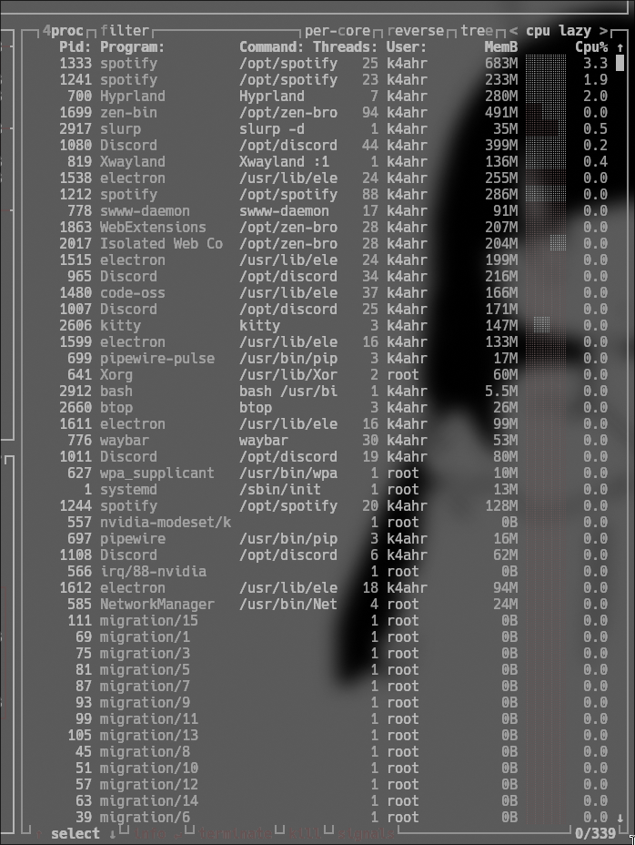
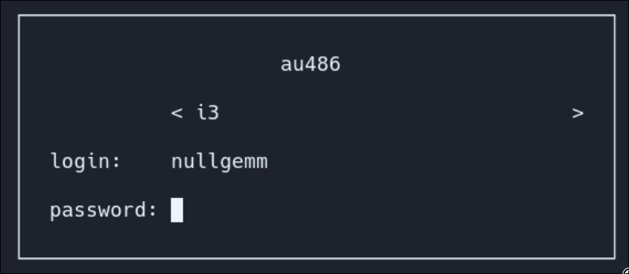
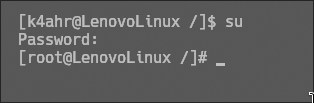
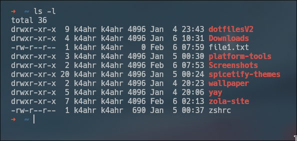
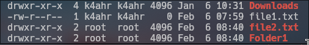

+++
title = "Linux từ mức cơ bản nhất"
description = 'i use arch btw'
date = 2025-02-06
+++


Linux là một trong những hệ điều hành khá hay mà ai theo CNTT cũng nên học. Khác biệt với những hệ điều hành khác như Windows và macOS, Linux là một hệ điều hành mã nguồn mở, chính vì vậy mà Linux có thể được tuỳ chỉnh từ ngoài vào trong. 

Nếu là người mới sử dụng, sẽ có cảm giác khó tiếp cận một chút, vì cách hoạt động của Linux khác với Windows. Đa số những tác vụ ta làm trên Linux sẽ thông qua cửa sổ lệnh Bash, hay còn gọi là Terminal. Đây sẽ là một số những yếu tố ta sẽ cần quan tâm khi sử dụng Linux, với các ví dụ sau sẽ được sử dụng qua Ubuntu, một bản phân phối phổ biến của Linux:

# ***1. File và cấu trúc của nó***
Khác với Windows và cách hoạt động là chia ổ cứng thành nhiều phân vùng với đường dẫn file riêng biệt mà ta biết như "C:\" hay "D:\", trong Linux tất cả các file sẽ đều chứa trong "/", hay còn được gọi là "Root directory". Root directory, hay chính là thư mục gốc, và tất cả cấu trúc và dữ liệu của Linux sẽ được chứa từ đây và bắt đầu chia ra thành nhiều thư mục con.


<p style="text-align:center">Nguồn: @Fireship</p>

Đối với Windows, mỗi phân vùng ổ cứng tạo ra một thư mục gốc, nhưng trong Linux, phân vùng mà mang thư mục gốc "/", sẽ chứa những phân vùng còn lại, tuỳ thuộc vào việc phân vùng đó được mount vào đâu. Dưới đây sẽ là một ví dụ:

Chạy lệnh `lsblk` vào trong terminal, ta có kết quả sau:

Máy ảo này hiện đang có 1 ổ cứng **sda** chứa 20GB và 1 ổ cứng **sdb** chứa 5GB. Trong đó, ổ cứng **sda** được chia thành 2 phân vùng là **sda1** và **sda2**. Ta sẽ bỏ qua **sda1** do đây là phân vùng để chứa BIOS Boot (ubuntu momento).

Hiện tại, **sda2** đang có mountpoint là "/", tức là **sda2** đang chứa toàn bộ đường dẫn của hệ thống, còn **sdb** thì chưa được mount vào máy ảo. Bây giờ ta sẽ mount ổ cứng **sdb** này vào trong thiết bị, với lệnh sau:
```
    $ sudo mount /dev/sdb /mnt
```
Ta sẽ thấy ổ cứng **sdb** đã được mount vào máy ảo, và có thể truy cập tại đường dẫn `/mnt`


Từ đó ta thấy được, rằng cho dù có chia ra bao phân vùng, một hệ thống Linux sẽ chỉ có một thư mục gốc "/", chứa toàn bộ dữ liệu của máy.

Vì "/" mang cấp cao nhất trong hệ thống file của Linux, nên mọi chỉnh sửa xung quanh thư mục "/" sẽ cần quyền truy cập cao nhất, hay còn gọi là "root". Thông thường, đối với những thiết bị Linux, người dùng lưu trữ và sử dụng các file sẽ được chứa trong thư mục "/home/'ten_nguoi_dung'", hay trong hệ thống được biết đến là đường dẫn "~". Những thư mục này thường sẽ được cấp quyền sửa đổi trực tiếp cho chính người dùng đó. 

<p style="text-align:center">Ví dụ của một thư mục /home</p>

Ngoài ra những thư mục chứa kí tự đầu trong tên thư mục bằng dấu ".", hay còn được gọi là "dotfiles" sẽ thường bị ẩn theo mặc định. Những thư mục này thường chứa các file config cho phần mềm, và được Linux ẩn để tránh bị chỉnh sửa không mong muốn.

<p style="text-align:center">Các thư mục dotfiles bị ẩn</p>


Ngoài thư mục "/home", một hệ thống Linux còn có những thư mục thiết yếu sau:
* /boot: Chứa kernel và bootloader sử dụng khi khởi động máy
* /dev: Chứa các thông tin và driver của thiết bị ngoại vi
* /etc: Chứa các file config hệ thống
* /var: Chứa các file log
* /bin: Chứa binary của hệ thống

Một số lệnh cơ bản để hoạt động trong thư mục của Linux:
* `cd`: Thay đổi thư mục
* `ls`: Hiện danh sách những files và folder trong thư mục đó
* `mkdir`: Tạo thư mục mới
* `rm`: Xoá files (để xoá thư mục sử dụng `rm -r`)
* `pwd`: Xuất đường dẫn của thư mục hiện tại
* `echo`: In ra một chuỗi kí tự gì đó ra cửa sổ lệnh
* `base64`: Sử dụng để encode/decode dữ liệu từ/thành base64, ví dụ như `aSB1c2UgYXJjaCBidHc=`

# ***2. Process trong Linux***
Process, hay tiến trình, hiểu nhanh chính là những chương trình hay những tác vụ đang chạy. Thông thường mỗi câu lệnh được thực thi trong Linux sẽ tạo ra một process mới. 

Ta sẽ sử dụng chương trình "btop" để xem những process đang chạy trong hệ thống:


Nhìn nhanh trong tấm screenshot trên, ta có thấy rằng mỗi process mang 1 PID (Process ID) riêng biệt. 

Có hai loại process chính:
* Foreground Process: Những process này thường được kích hoạt ngay sau khi nhập lệnh, và đồng thời trong cùng khoảng một thời gian không thể có thêm bất kỳ nhập lệnh nào khác.
* Background Process: Những process này thường chạy trong hệ thống mà không cần bắt buộc nhập liệu nào từ người dùng. Chính vì vậy, những process này có thể chạy song song trong cùng một thời điểm.

Ngoài ra, trong Linux có Daemon Process, là những background process liên quan đến hệ thống nhưng lại cần quyền hạn từ root và hoạt động cùng với những process khác. 

# ***3. User và group trong Linux***

User và group được sử dụng với mục đích chiếm quyền điều khiểu và truy cập các file, thư mục, phần mềm, vân vân và mây mây.

Ta có thể hiểu đơn giản, 1 user (hay người dùng), chính là đại diện cho 1 người nào đó sử dụng máy tính, được phân biệt bằng một username riêng biệt và bảo vệ bằng mật khẩu, và một hệ thống Linux có thể chứa không giới hạn người dùng.

Khi khởi động thiết bị, để bắt đầu truy cập và sử dụng hệ thống, người dùng cần phải nhập hoặc chọn username và nhập mật khẩu tương ứng.

<p style="text-align:center">Màn hình đăng nhập Linux</p>

Chính vì không có giới hạn là bao nhiêu user trong Linux, nên để quản lý toàn bộ tất cả các user, Linux sẽ có một Superuser, hay được biết là tài khoản "root". Tài khoản root có được quyền truy cập và sửa đổi hệ thống cao nhất, với không một giới hạn. Ngoài ra, cũng giống như Process, mỗi user có một ID riêng biệt gọi là UID, với user mang UID 0 chính là tài khoản "root".

Có hai cách để truy cập vào tài khoản root: Đăng nhập bằng username "root" ngay sau khi khởi động Linux, hoặc chạy lệnh "su" và nhập mật khẩu. Như screenshot ở dưới, mình đã truy cập từ tài khoản với username là "k4ahr" sang tài khoản "root".

<p style="text-align:center">Tài khoản root</p>

Tuy nhiên, việc liên tục sử dụng tài khoản root mang rất nhiều rủi ro về bảo mật, chính vì vậy để sử dụng quyền hạn cao nhất tạm thời, ta sử dụng lệnh "sudo <lệnh_muốn_sử_dụng>"

Group (nhóm) về đơn giản là các nhóm được phân chia cho các tài khoản user. Mỗi group có thể chứa nhiều user, nhằm tối ưu dễ dàng hơn trong việc phân ra các quyền hạn cho các user, với mỗi group mang một ID riêng biệt gọi là GID. 

Mặc dù mỗi máy tính cá nhân như PC thông thường hay laptop chạy Linux thường chỉ có một người sử dụng, khiến cho việc phân chia quyền hạn cho nhiều user và các group user nghe có vẻ vô nghĩa, nhưng trên thực tế vì hơn 96,4% các hệ thống server chạy Linux, nên việc phân chia user và group rất quan trọng, phục vụ cho các vấn đề an ninh và bảo mật hệ thống, cũng như giới hạn các user và group với những quyền hạn được cấp nhất định. 

Và sẵn nói đến quyền hạn....


# ***4. Phân quyền trong Linux***

Trong hệ thống Linux, tất cả các hoạt động đều được dựa trên quyền hạn của ba hoạt động chính:
* Write: Cho phép người dùng tạo hoặc chỉnh sửa file và hệ thống.
* Read: Cho phép người đọc file và hệ thống.
* Execute: Cho phép người dùng thực thi các hoạt động hoặc lệnh từ file và hệ thống.

Ta sẽ bắt đầu bằng việc chạy lệnh "ls -l" để liệt kê phân quyền của các file trong thư mục "/home/k4ahr", hay chính là thư mục user của mình:


Ta sẽ tập chung vào cột đầu tiên, lấy ví dụ một dòng giá trị tương tự là "drwxrwxrwx", phân tích nhanh thành "d rwx rwx rwx" để cho dễ nhìn 1 chút, ta có những giữ liệu như sau:
* "d": Ký hiệu rằng đây là 1 thư mục
* "rwx" thứ nhất: Hiển thị quyền hạn mà chủ nhân của file vào trong chính file đó
* "rwx" thứ hai: Hiển thị quyền hạn mà group người dùng có lên file đó
* "rwx" thứ ba: Hiển thị quyền hạn mà user có lên file đó

Giờ ta sẽ phân tích ý nghĩa các ký hiệu nằm trong cụm "rwx":
* Cột thứ nhất:
    - r: File/Folder có thể được đọc
    - -: File không được phép đọc, folder không hiển thị file

*  Cột thứ hai:
    - w: File/Folder có thể được chỉnh sửa
    - -: File/Folder không thể được chỉnh sửa, dữ liệu trong folder không thể thêm, xóa hay chỉnh sửa

* Cột thứ ba:
    - x: File có thể được thực thi
    - -: File không thể được thực thi

Ngoài ra đối với cột thứ ba liên quan đến thực thi, Linux còn có những ký hiệu khác như "t", "s", "S", tuy nhiên ta có thể tạm thời bỏ qua những giá trị đó.

Giờ ta sẽ lấy nhanh một vài ví dụ, với hai user ở đây là "k4ahr" và "root":


* Đối với thư mục "Download", vì k4ahr là owner của thư mục đó, nên k4ahr có thể viết, đọc và thực thi trong thư mục đó.
* Đối với "file1.txt", k4ahr có thể đọc và viết lên file đó, nhưng không thể thực thi file đó nếu như đó là 1 file script
* Đối với "file2.txt", vì owner của file này là "root", nên ta nhìn vào dãy thứ ba là "r-x", có nghĩa những user khác như k4ahr có thể đọc và thực thi file đó, nhưng lại không thể chỉnh sửa file đó

Tuy vậy, hầu hết các file hay thư mục ở đây luôn có thể được ghi đè quyền hạn nếu mặc dù không có bằng một trong hai cách:
* Sử dụng câu lệnh [chmod](https://man.archlinux.org/man/chmod.1) để chỉnh sửa quyền hạn của một file/folder
* Sử dụng "sudo" để ghi đè mọi permission (vì sudo cấp quyền root tạm thời lmao)


Và đó là những điều cơ bản cần hiểu về Linux. Nói chung đây mới chỉ là mức cơ bản nhất của Linux, nếu rơi vào rabbit hole của thế giới Linux thì còn rất nhiều vấn đề để chúng ta nói.

Đây là lần đầu mình viết write-up, nên nếu bạn muốn góp ý cho bài write-up này, liên hệ mình qua: k4ahr@getgoogleoff.me

Reference:
* [Arch Linux Wiki](https://wiki.archlinux.org/title/Main_page)
* [100+ Linux Things you Need to Know](https://www.youtube.com/watch?v=LKCVKw9CzFo)


<p style="text-align:center;">
    
    
</p>
