+++
title = "OWASP Top 10"
description = 'chắc là part 1'
date = 2025-08-12
+++

OWASP Top 10 là danh sách 10 rủi ro bảo mật phổ biến và nghiêm trọng nhất trong phát triển ứng dụng web, được OWASP (Open Web Application Security Project) tổng hợp và cập nhật định kỳ dựa trên dữ liệu thực tế từ các tổ chức bảo mật và cộng đồng.

Nó đóng vai trò như một tiêu chuẩn tham khảo để lập trình viên, tester, và chuyên gia an ninh mạng biết được những lỗ hổng nào cần ưu tiên xử lý. Danh sách này bao gồm:

* Injection
* Broken Authentication
* Sensitive Data Exposure
* XML External Entity
* Broken Access Control
* Security Misconfiguration
* Cross-site Scripting
* Insecure Deserialization
* Components with Known Vulnerabilities
* Insufficent Logging & Monitoring

# 1. Injection
Lỗi Injection xảy ra khi dữ liệu do người dùng nhập vào được ứng dụng hiểu và xử lý như lệnh hoặc tham số thực, dẫn đến nguy cơ bị tấn công. Một số dạng phổ biến gồm:

* SQL Injection: Kẻ tấn công chèn lệnh SQL vào truy vấn để thay đổi, truy cập hoặc xóa dữ liệu.
* Command Injection: Kẻ tấn công chèn lệnh hệ thống để thực thi trên máy chủ.

Hậu quả có thể là đánh cắp thông tin nhạy cảm, chiếm quyền hệ thống, hoặc thực hiện các cuộc tấn công khác.

Biện pháp phòng tránh:

* Allow list: Chỉ chấp nhận dữ liệu đã được định nghĩa là an toàn.
* Loại bỏ ký tự nguy hiểm trước khi xử lý.
* Sử dụng thư viện chuyên dụng để kiểm soát và lọc dữ liệu đầu vào.

Command Injection là lỗ hổng web xảy ra khi mã phía server (như PHP) gọi lệnh hệ thống và kẻ tấn công lợi dụng để thực thi lệnh trên máy chủ. Ban đầu, họ có thể chỉ chạy các lệnh đơn giản như `whoami` hoặc đọc file, nhưng nguy hiểm nhất là mở **reverse shell** (ví dụ `;nc -e /bin/bash`) để chiếm quyền dưới tài khoản mà web server đang chạy. Khi đã xâm nhập, kẻ tấn công có thể dò quét hệ thống và tìm cách mở rộng tấn công sang các hệ thống khác.

Mình sẽ vào Task 5 của mục OWASP Top 10 bởi tryhackme.com và bắt đầu vào instance của nó.

* What strange text file is in the website root directory?: Mình sẽ sử dụng lệnh `ls` để hiển thị các file trong root directory của web server

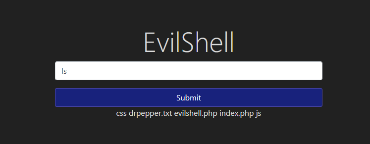

Câu trả lời sẽ là `drpepper.txt`

* How many non-root/non-service/non-daemon users are there?: Sử dụng lệnh `cat /etc/passwd` sẽ hiển thị các trình

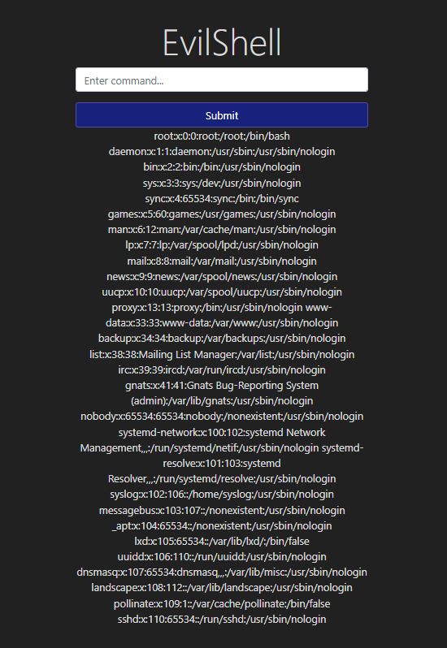

Nếu để ý kỹ, ta sẽ thấy không thật sự có tài khoản nào giống một tài khoản người dùng bình thường với shell thật như `/bin/bash` hay `/bin/zsh`. Vậy câu trả lời sẽ là 0.

* What user is this app running as?: Ta chỉ đơn giản sử dụng lệnh `whoami` để biết được cái shell này đang sử dụng user nào.

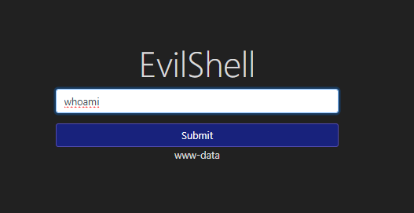

* What is the user's shell set as?: Sử dụng lệnh `getent passwd "tên user"` để lấy shell được đặt cho user đó, ví dụ với root mặc định, ta sẽ có kết quả là `/bin/bash`.

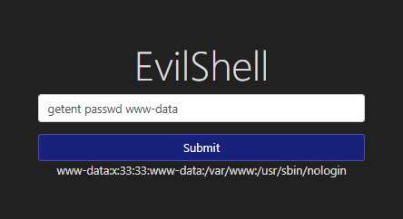

* What version of Ubuntu is running?: Ta có thể kiểm tra phiên bản của một hệ điều hành Linux qua câu lệnh `cat /etc/os-release`.

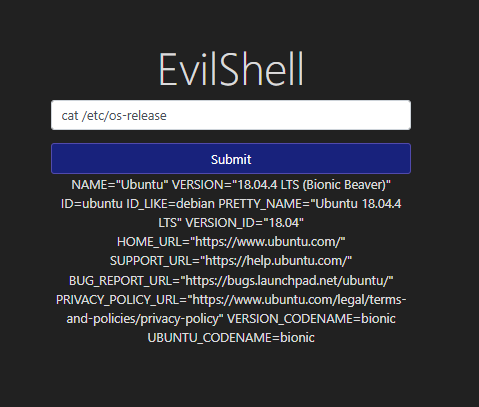

* Print out the MOTD.  What favorite beverage is shown?: MOTD (Message of the Day) là thông điệp hiển thị khi đăng nhập vào Linux/Unix, thường dùng để chào mừng hoặc thông báo tình trạng hệ thống và được lưu ở `/etc/`, đầu tiên mình sẽ dùng `ls` và `grep` để tìm file, sau đó đọc bằng `cat`.

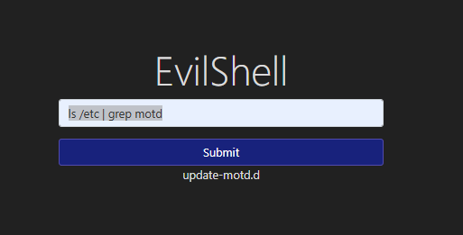
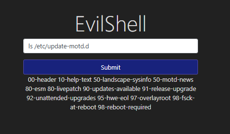
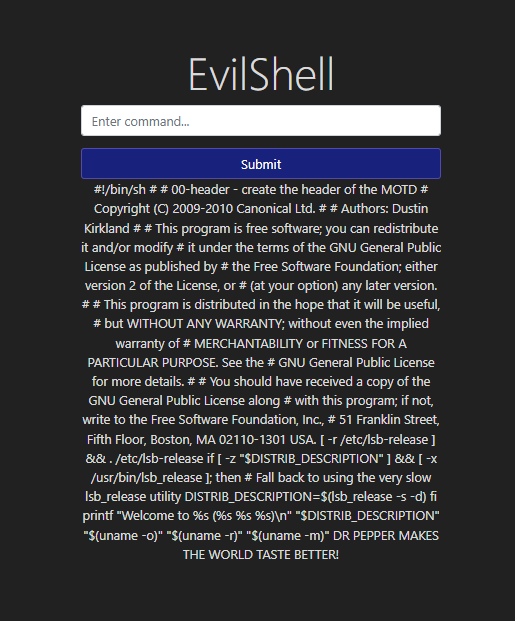

*Thực ra là làm cho biết chứ từ câu một đã có thể đoán được là Dr.Pepper rồi:v*

# 2. Broken Authentication

Xác thực và quản lý phiên là thành phần cốt lõi của ứng dụng web.

* **Xác thực**: Thường dùng tên đăng nhập và mật khẩu, nếu đúng sẽ cấp **session cookie** để duy trì trạng thái người dùng (vì HTTP(S) là stateless).
* **Những vấn đề có thể gặp phải:**:

  * **Brute force**: Thử nhiều lần để đoán tài khoản/mật khẩu.
  * **Mật khẩu yếu**: Cho phép đặt mật khẩu dễ đoán như `password1`.
  * **Session cookie yếu**: Giá trị dễ đoán, kẻ tấn công có thể giả mạo.
* **Một số biện pháp xử lí**:

  * Áp dụng chính sách mật khẩu mạnh.
  * Khóa tài khoản sau số lần đăng nhập thất bại nhất định.
  * Sử dụng **đa yếu tố xác thực (MFA)** để tăng bảo mật.

Tiếp theo mình sẽ vào Task 7 và bắt đầu vào instance của nó.

Theo đề bài, nếu ta đăng ký sử dụng tên tài khoản đã có, nhưng với 1 vài chỉnh sửa nhỏ như 1 cái dấu cách, ta hoàn toàn có thể truy cập dữ liệu tài khoản đó. Ta sẽ tạo 1 tài khoản là " darren", với cái dấu cách đó và login vào hệ thống.

* What is the flag that you found in darren's account?: Có một đoạn mã ngắn có vẻ chính là flag ta đang tìm.

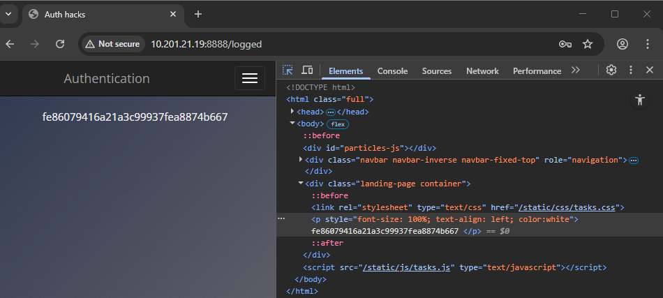

* Now try to do the same trick and see if you can login as arthur: Ta sẽ làm điều tương tự với tài khoản arthur.

* What is the flag that you found in darren's account?: Tương tự.
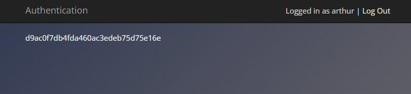

# 3. Sensitive Data Exposure

Sensitive Data Exposure xảy ra khi ứng dụng web vô tình tiết lộ dữ liệu nhạy cảm như thông tin cá nhân, tài chính, hoặc thông tin kỹ thuật (tài khoản, mật khẩu). Nguyên nhân có thể từ:

* Tấn công Man-in-the-Middle: Kẻ tấn công chặn kết nối và lợi dụng mã hóa yếu hoặc không mã hóa để lấy dữ liệu.

* Cấu hình kém: Dữ liệu nhạy cảm có thể nằm trực tiếp trên máy chủ và bị truy cập dễ dàng.

Lỗ hổng dạng này có thể nghiêm trọng nhưng đôi khi lại rất đơn giản để khai thác, không cần kiến thức mạng phức tạp.

Mình sẽ vào Task 11 và bắt đầu vào instance của nó.

* What is the name of the mentioned directory?: View page source của trang web app, ta thấy có một thư mục chứa tấm hình ảnh trên trang web `assets`, có vẻ đó chính là thư mục cần tìm.

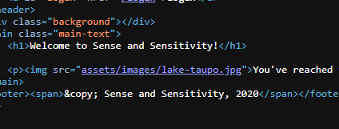

* Navigate to the directory you found in question one. What file stands out as being likely to contain sensitive data?: Chui vào trong thư mục `assets` bằng cách thêm vào sau địa chỉ của webapp, ta sẽ thấy 1 file database ~~mà đáng nhẽ nó không nên ở đó?~~

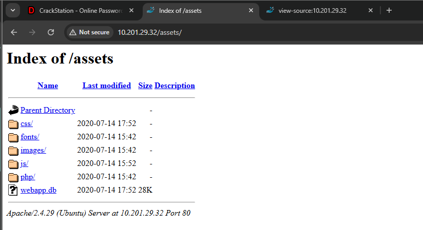

Use the supporting material to access the sensitive data. What is the password hash of the admin user?: Mình sẽ lấy file database trước đó bằng `wget` vào trong hệ thống Linux của mình, và sử dụng `sqlite3` như document của tryhackme trước đó nói và tìm ra password hash của admin.

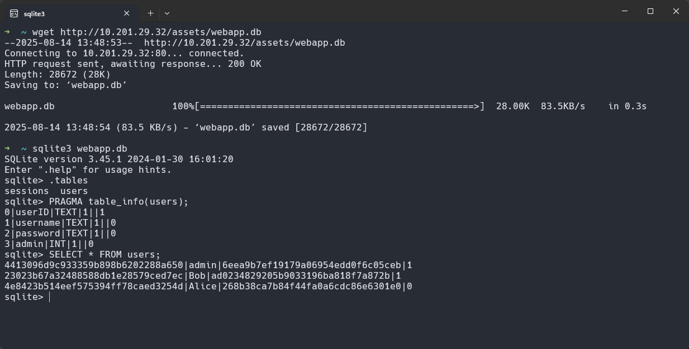

* What is the admin's plaintext password?: Sử dụng [crackstation.net](https://crackstation.net/) và nhập hash trước đó, ta có password của admin trước đó được mã hoá bằng md5.

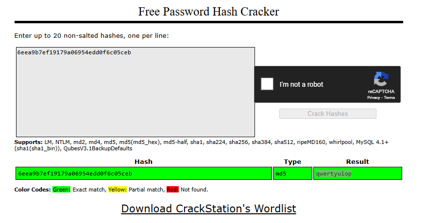

* Login as the admin. What is the flag?: Quay lại webapp trước đó, đăng nhập với mật khẩu admin ta tìm được và ta đã có flag cần tìm.

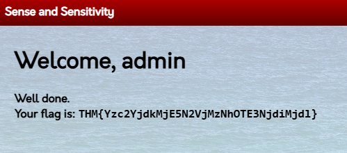