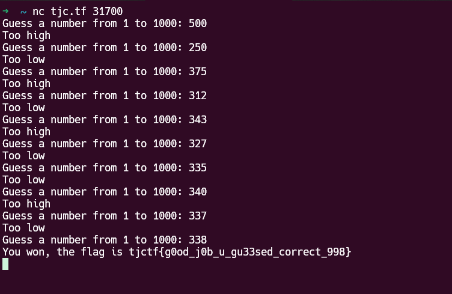
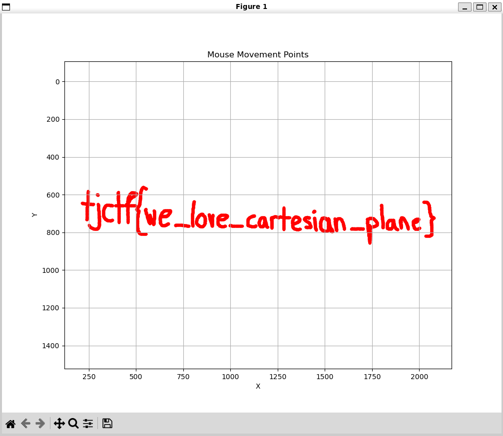
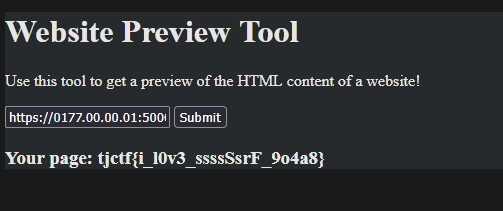
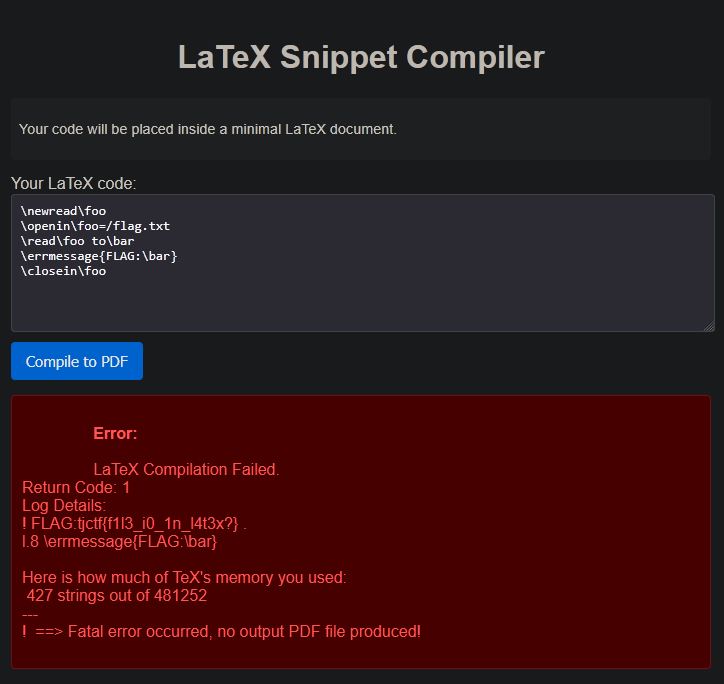

+++
title = "TJCTF 2025"
description = 'One of the first I guess'
date = 2025-06-08
+++

TJCTF 2025 có thể nói là một trong những cuộc thi CTF quốc tế đầu tiên mà mình tham gia cùng với đồng đội, với team [0day@freddy](https://ctftime.org/team/387182). Mặc dù không phải là những cuộc thi CTF đầu tiên của mình, nhưng mình lại chưa thực sự giải được nhiều challenges so với mọi người trong team. Đây sẽ là writeups về những challenge mà mình đã giải được.

# misc/guess-my-number

Một bài phải gọi là vua của cơ bản, đoán lấy con số đúng trong khoảng từ 1 đến 1000 trong 10 lượt đoán. Kỹ thuật ở đây là luôn đoán con số ở chính giữa, từ đó dẽ dàng loại trừ và tìm đoán lấy con số tiếp theo.



# misc/mouse-trail

Chúng ta được cấp 1 file text *mouse_movements.txt* theo đề bài, là toạ độ di chuyển của chuột. Kiểm tra thì ta thấy hơn 4000 dòng toạ độ x và y được log lại vào file text. Ta có thể biểu diễn toạ độ của file text này lên một trục toạ độ Đề-các (Descartes) bằng thư viện Matplotlib trong python. Sau một lúc sử dụng chatGPT để tạo script sử dụng Matplotlib và nhập toạ độ từ file *mouse_movements.txt*, ta có kết quả sau trên hệ trục toạ độ.




# web/loopy
Đề bài là liệu chúng ta có thể truy cập vào trang admin với port 5000. Instance được cấp là một tool xuất toàn bộ content HTML của một website. Để xuất được trang admin của chính instance, ta chỉ cần điều hướng chính nó về localhost, với port 5000 vào trang /admin. Mình đã thử với URL `https://localhost:5000/admin`, tuy nhiên hệ thống chặn với thông báo như sau:

* Access denied. URL parameter included one or more of the following banned keywords: [::], 017700000001, 0.0.0.0, ffff, ::1, 2130706433, local, 127

Vậy có nghĩa là `localhost` và `127.0.0.1` đều bị chặn do chứa `local` và `127`. Tuy nhiên trong list cũng có một số là `017700000001`, khi tách ra thành `0177.00.00.01` thì đây lại chính là hệ bát phân khi chuyển từ hệ thập phân của 127.0.0.1, nên mình đã thử `https://0177.00.00.01:5000/admin`, và bypass thành công hệ thống chặn.



# web/TeXploit

Ta được cung cấp một trình biên dịch LaTeX online. LaTeX là một ngôn ngữ để eyecandy các tài liệu văn bản, ví dụ như luận văn, sách hoặc bài báo, và chạy trên một hệ thống gọi là Tex, mà trong đó chứa những câu lệnh đơn giản mà ta có thể khai thác để lấy flag. Mục tiêu là đọc nội dung của file /flag.txt mà không thể truy cập trực tiếp (như với \input), do một vài keyword đã bị blacklist. 

Sử dụng những câu lệnh của LaTex, ta có một payload sau:

```
\newread\foo            # Khai báo lấy một input stream tên \foo
\openin\foo=/flag.txt   # Mở file /flag.txt và đưa vào \foo
\read\foo to\bar        # Đọc một dòng đầu tiên từ file /flag.txt, và lưu nội dung vào biến \bar
\errmessage{FLAG:\bar}  # Tạo một thông báo lỗi và kẹp biến \bar chứa flag vào trong đó
\closein\foo            # Đóng input stream \foo, không cần thiết đâu nhưng mà trông nó gọn
```
Sau khi hệ thống xử lí và báo lỗi thì thông báo lỗi mà ta tạo trước đó với biến \bar chứa flag sẽ được đưa ra cùng trong Log.


